\# 照片欣赏
[https://www.christopherandersonphoto.com/OVERVIEW/thumbs](https://www.christopherandersonphoto.com/OVERVIEW/thumbs)

\# 基本理论

\## 光圈
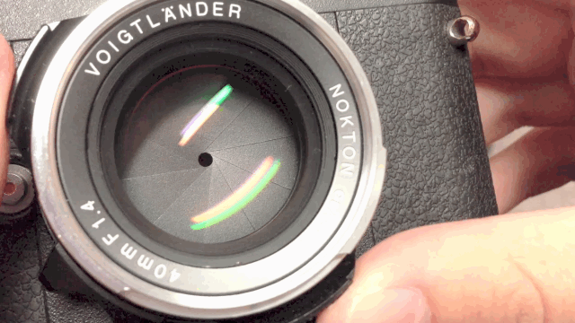

F越小 光圈越大

\*\*光圈越大，景深越浅\*\*

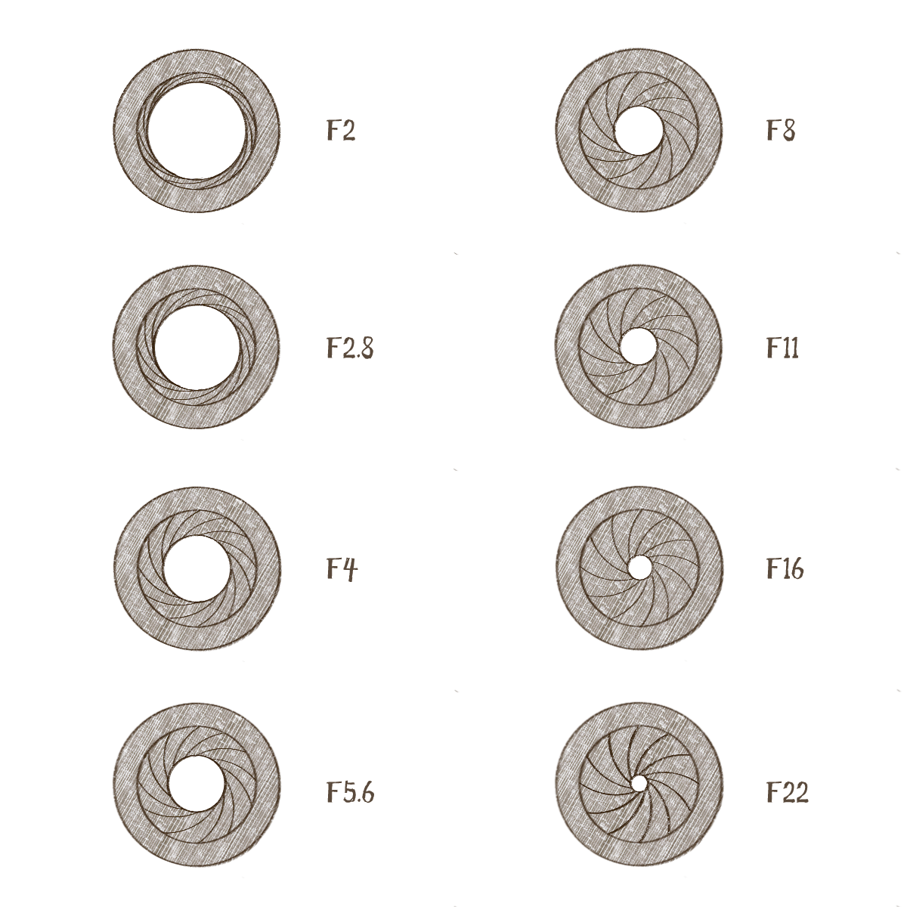

\## 景深
清晰的距离

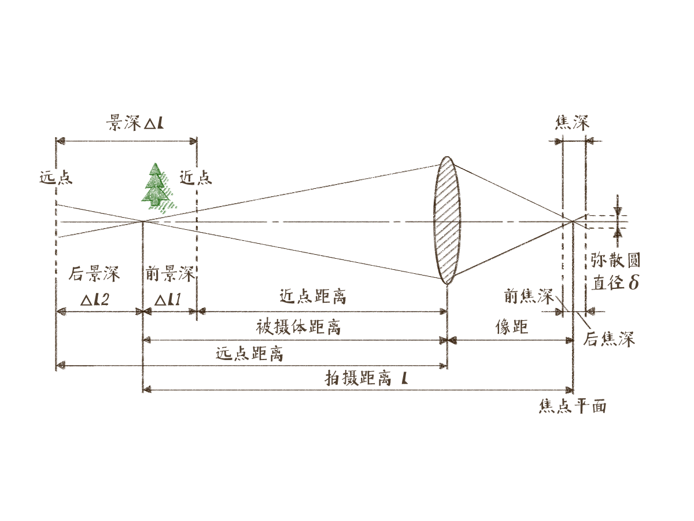

光圈越大 景深越浅

小光圈=》纪实

\## 焦段

焦段越大景深越浅

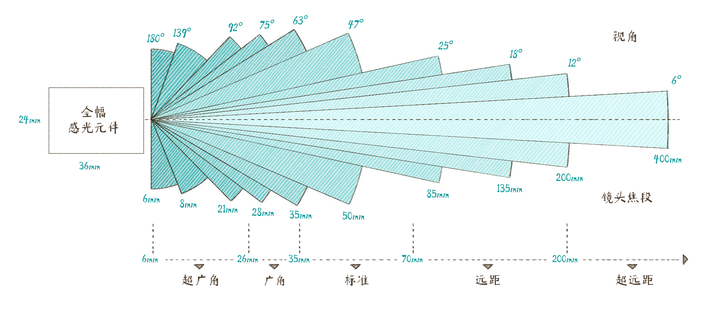

\## 快门
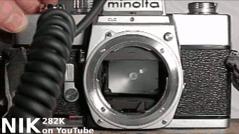

多少分之一秒

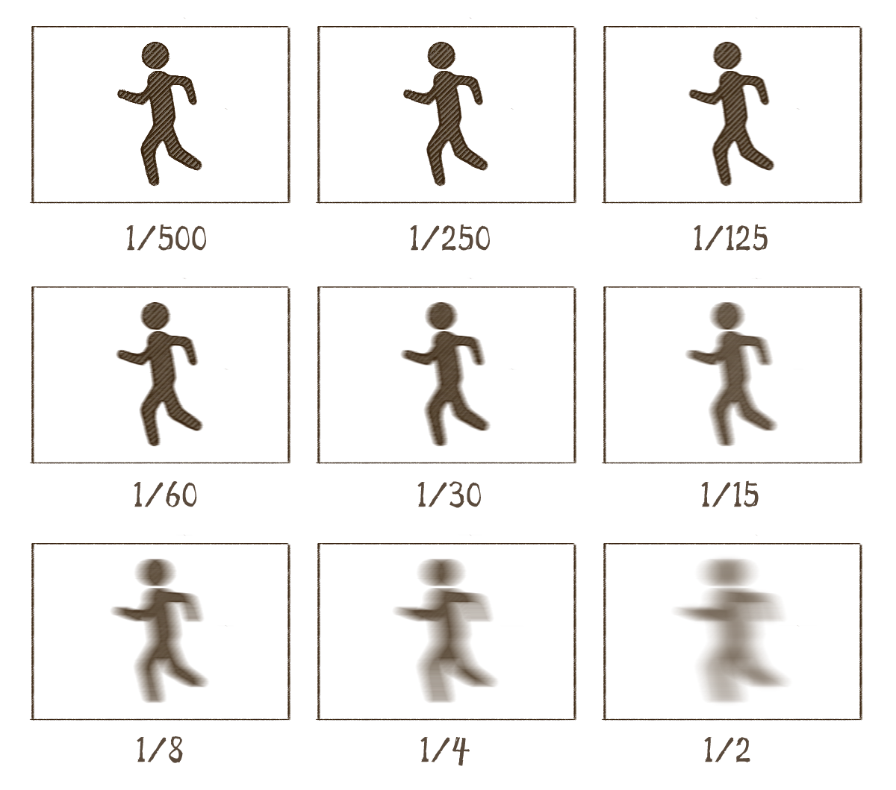

\## 步长
科技在发展，技术在进步，参数值控制粒度在升级

\## ISO 感光度

感光度越高 曝光能力越强 缺点：噪点越大

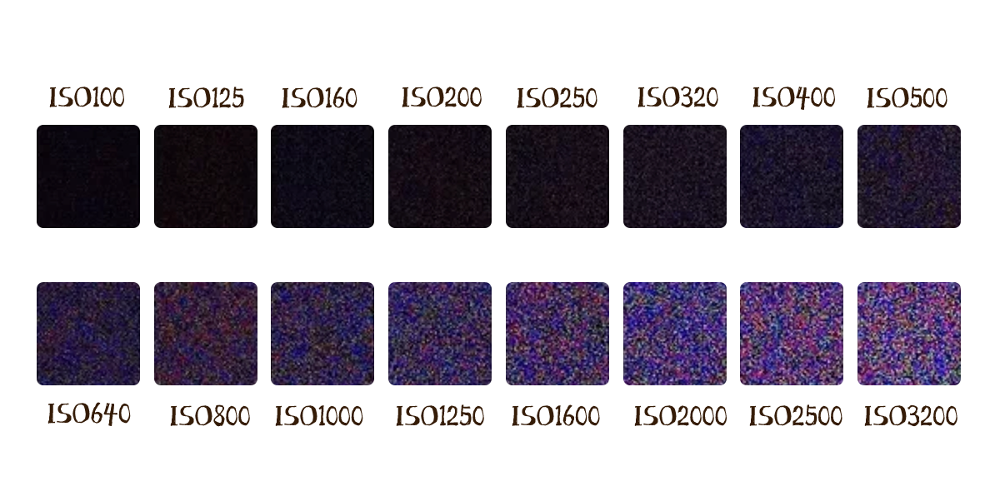

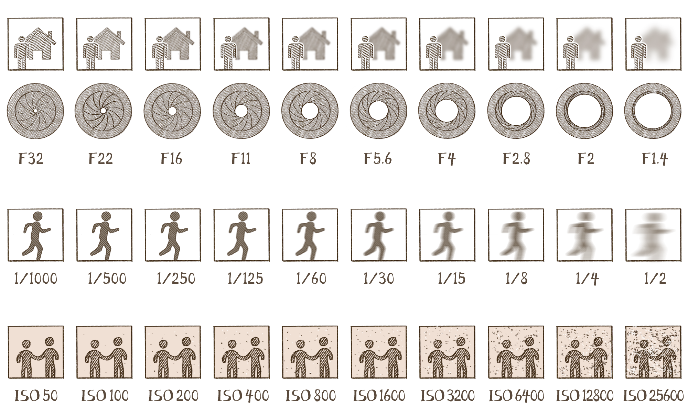

\## 白平衡
颜色正确

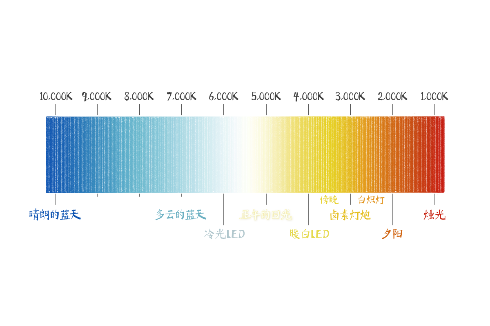

\## RAM格式

保存所有原始信息

\## 宽容度
\*\*指的就是感光元件所能正确容纳的画面亮度反差的范围\*\*，说白了就是，\*\*画面最亮的部分和画面最暗的部分，能不能都被相机以不损失成像细节的方式给拍下来\*\*。如果能，就叫宽容度大，如果不能，就叫宽容度小。

\## HDR (High-dynamic-range)
拍三张（甚至更多张）照片，一张欠曝的以捕捉高光信息，一张正常曝光，一张过曝的以捕捉暗部信息，经过机内算法计算，把几张照片合成在一起，最终成片。这一技术通常应用于大光比场景

​

\## 测光

EV=Exposure Values 曝光值

\## 白平衡

白平衡是平衡颜色的，只要画面里的白或灰或黑没有 RGB 任何方向上的偏移就说明颜色是准的，说白了，“白平衡”就是给照片儿套上一层“颜色准确”的滤镜；而测光测的是灰阶亮度，也就是说，把一张照片儿变成黑白照片儿以后看测光点所在区域的灰阶亮度是多少...白平衡和测光这俩东西基本没啥交集

​

\# 相机

\## 画幅
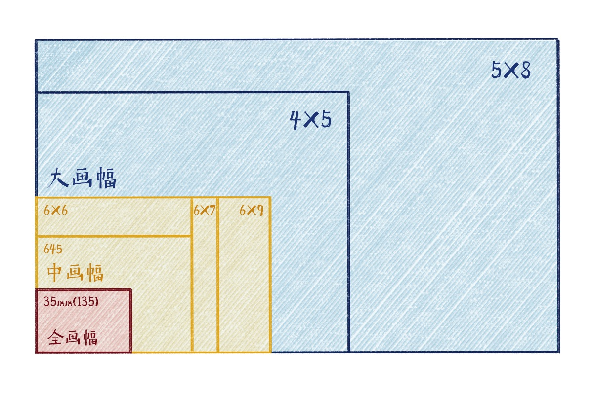

画幅 感关元件

\*\*所有感光元件尺寸在 36mm x 24mm 左右的相机，我们都把它叫作全画幅。\*\*

\*\*画幅越大，景深越浅\*\*

\*\*​\*\*

\# 光

\## 质量

距离，强弱

\## 方向
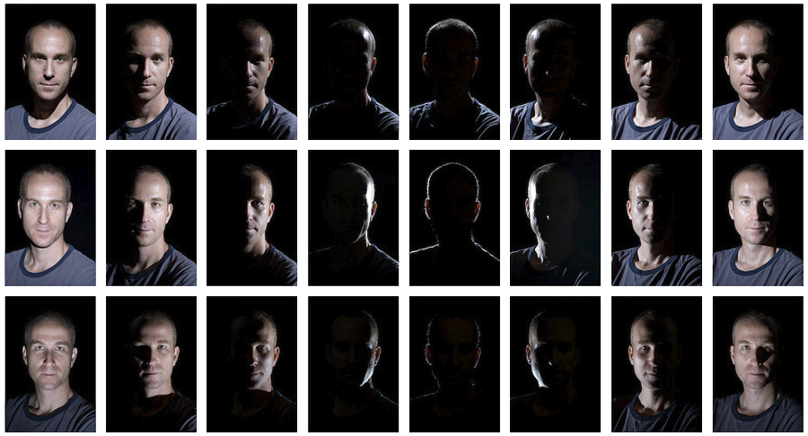