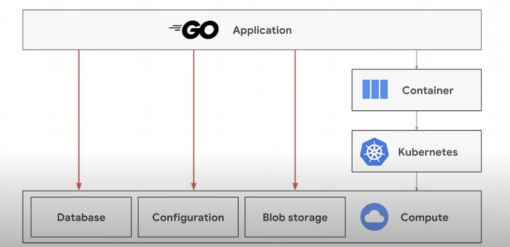
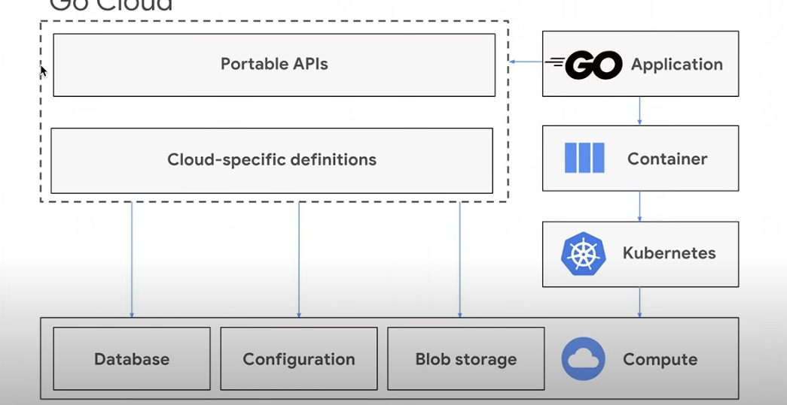

**为什么k8s prow plank能使用OSS(阿里云)或QingStor(青云)---日志上传逻辑源码解读**

**​**

** **

​

# control 开发

controller-runtime <- kubebuilder 子项目

 ｜

 client-go

# pod 装饰
​

三个[init容器](https://kubernetes.io/zh/docs/concepts/workloads/pods/init-containers/)：

clonerefs

...prowjob定义的

initupload

entrypoint

​

sidecar

​

​

# 日志upload逻辑

sidecar 被term - gcsupload assemble之后 - pod-utils/gcs - pkgio - [go CDK](https://github.com/google/go-cloud) - qingstor

​

qingstore - 协议- [go CDK](https://github.com/google/go-cloud) - io(pkgio) - pod-utils/gcs - gcupload - sidecar

​

​

​

# 相关资料
[Amazon S3](https://docs.aws.amazon.com/zh_cn/AmazonS3/latest/userguide/Welcome.html)

[google cloud storage](https://cloud.google.com/storage/docs/samples/storage-s3-sdk-list-objects)

​

[qingcloud](https://docs.qingcloud.com/qingstor/)

​

[aliyunOSS](https://help.aliyun.com/document_detail/64919.html)

[标准google cloud go sdk ](https://github.com/googleapis/google-cloud-go)

​

GO CDK解决的问题:

｜

​