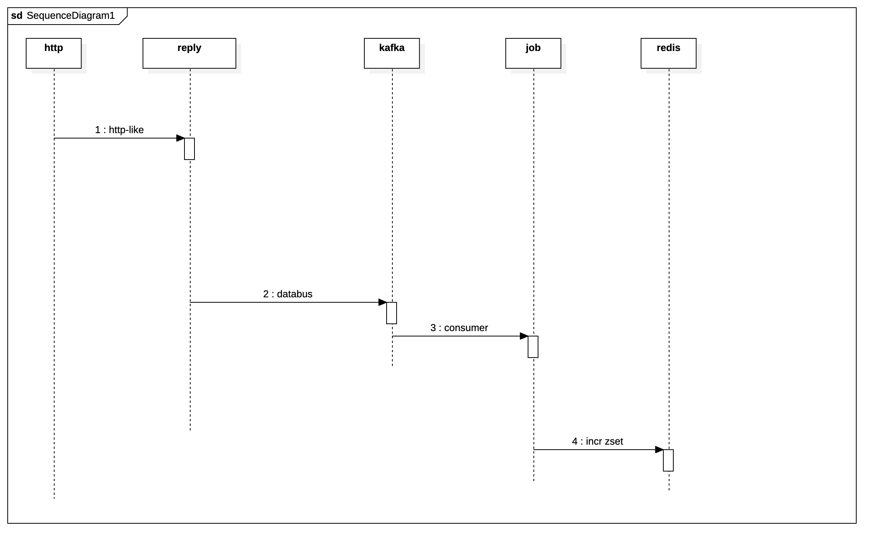

# 阶段一 all in one sql

关联子查询
```sql
select id,ss,tmp1.context,tmp1.link_id from
 (select context,agree,link_id ,max(agree) as ss from comment group by link_id order by agree) tmp1
 left join comment on tmp1.ss = comment.agree and tmp1.link_id = comment.link_id ;


 --

select link.link ,tmp2.context,link.id,tmp2.ss
from link left join (
select id,ss,tmp1.context,tmp1.link_id,ss from
 (select context,agree,link_id ,max(agree) as ss from comment group by link_id order by agree) tmp1
 left join comment on tmp1.ss = comment.agree and tmp1.link_id = comment.link_id ) tmp2 on tmp2.link_id = link.id ;

select c0.*
from comment c0
 where c0.id in (
 select max(c1.id) id
 from comment c1
 inner join (select c2.link_id, max(c2.agree) agree
 from comment c2
 where
 c2.delete_time is null
 and c2.agree > 0
 group by c2.link_id) tmp on tmp.link_id = c1.link_id and tmp.agree = c1.agree
 group by c1.link_id )
```

优：简单快速

劣： 性能堪忧

# 阶段二 muti-simple sql
两次查询

优：简单快速

劣：性能堪忧

​

热评维度单一，更复杂的业务逻辑没法支撑，比如优先展示关注的人的热评；

# 架构演化阶段三



优：能hold主大流量

劣：非实时

​

​

# 阶段4 once more
分布式任务 distributed job