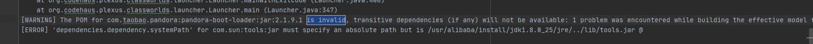

依赖不传递

mvn -X install > install.txt

搜关键字：is invalid

\`[WARNING] The POM for com.taobao.pandora:pandora-boot-loader:jar:2.1.9.1 is invalid, transitive dependencies (if any) will not be available: 1 problem was encountered while building the effective model for com.taobao.pandora:pandora-boot-loader:2.1.9.1\`

\`[ERROR] 'dependencies.dependency.systemPath' for com.sun:tools:jar must specify an absolute path but is /usr/alibaba/install/jdk1.8.0\_25/jre/../lib/tools.jar @ \`

