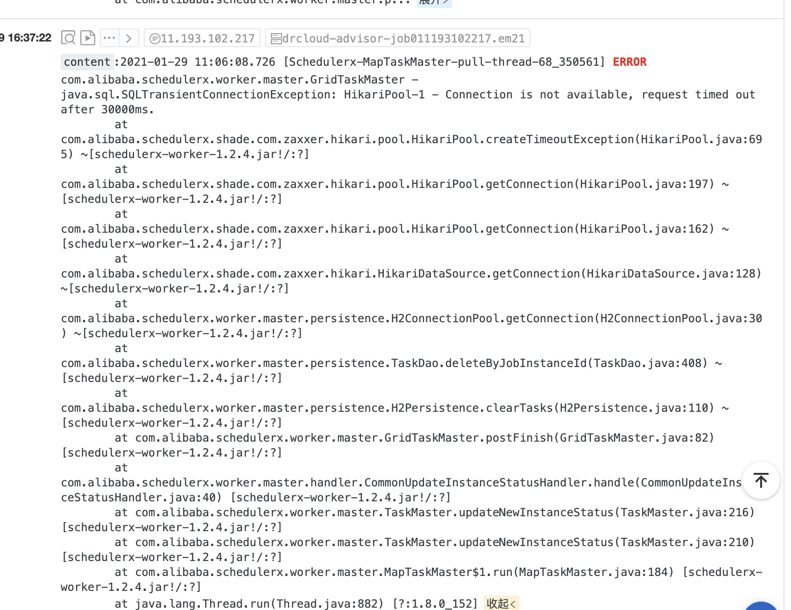

\# 1 明明有类却仍然报NoSuchBeanDefinitionException
devtools导致的类加载器不同
\`\`\`
 org.springframework.bootspring-boot-devtoolsruntimetrue
\`\`\`

\# 2

com.alibaba.schedulerx.worker.master.persistence.H2ConnectionPool

这个是客户端建的一个连接池 默认是本地h2数据库。子任务任务数量多了并发高了 ，连接池就不够用了