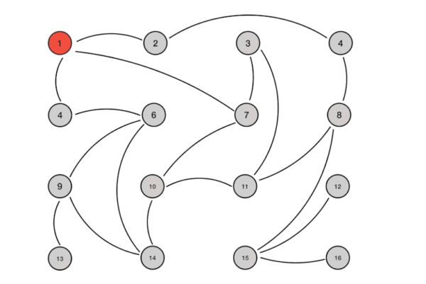

\# p1 理论 是什么

[assert/20200721152655836.gif](assert/20200721152655836.gif)

\# p2 关注点（提出正确的问题，问题引导，清晰目标），看源码的心法， 从模糊到清晰
A-meesage to->B

消息内容是什么？ addInfo进来的 存在store里面的

B是如何确定的？

消息如何存储，处理的？ infoStore

消息如何发送的？rpc

\# p3依赖知识领域 交代
golang语言本身

chan 与goroutine

grpc

bazel

\# p4 先看宏观设计（大图）
​

processon

\# p5 相关依赖代码交代
stopper 重要

HLC

circuitbreaker 不重要xR

metric 不重要

\# p6 核心代码[剖析](https://www.google.com/search?newwindow=1&safe=strict&sxsrf=ALeKk00x5c1jeJiBL0f3p0UFulBMtBiXqA:1607852983261&q=%E5%89%96%E6%9E%90&spell=1&sa=X&ved=2ahUKEwiN76uP18rtAhWPy4sBHaMeCJ0QkeECKAB6BAgGEDY)、品味实现细节

细节：

消息时间戳

并发控制 ...

获取哪个节点访问：getNextBootstrapAddressLocked

client代码：sendGossip vs requestGossip 区别为什么 requestGossip 没有发送Delta

​

output: [https://www.bilibili.com/video/BV11h411Z73Q](https://www.bilibili.com/video/BV11h411Z73Q?spm\_id\_from=333.999.0.0)