\# 概念
是什么？有什么用？

关键思想：少数服从多数 quorum

\### 算法还是协议？
raft is Algorithm? 见raft.github.io

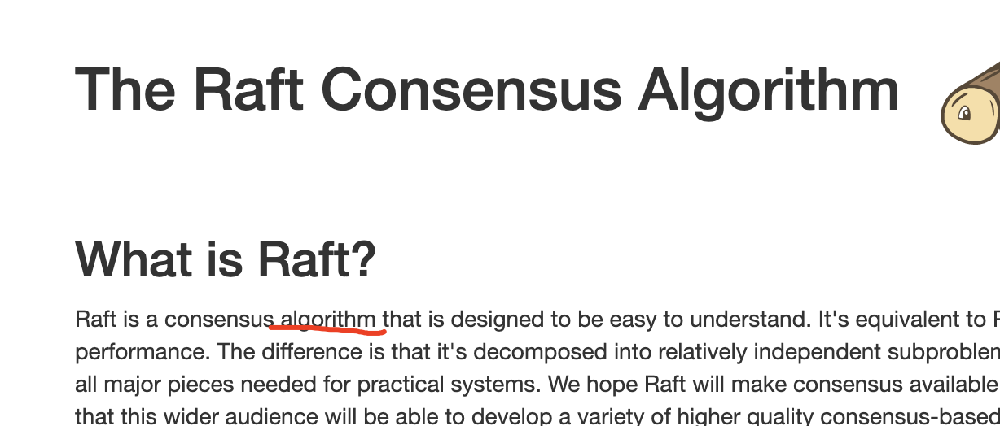

raft is Protocol ?见etcd文档

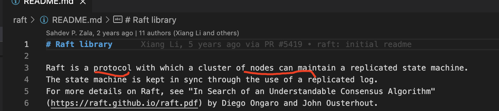

其实两种说法都对，协议强调的是实现是节点间通信过程，算法语境一般在理论

\### 一致性还是共识？什么是一致性？
Consensus n. 多翻译成共识

Consistent adj. 多翻译成一致性 形容词

论文中多数用的是consensus，consistent指log consistent 日志副本一致性

应该说：raft共识算法取得日志副本一致性

共识是系统实现层面描述，一致性是应用业务层面描述

或者说是一种容错系统fault tolerance

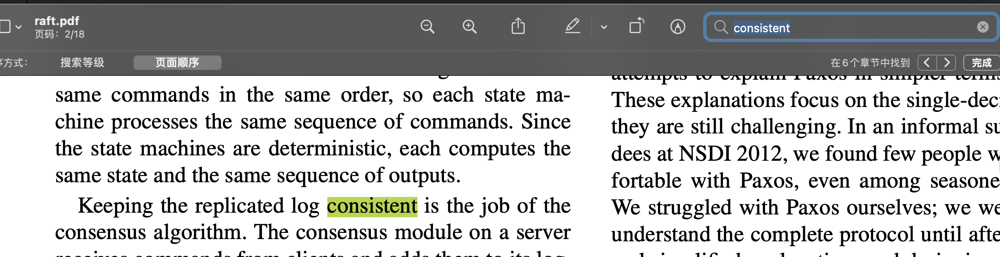

​

区分其他领域的一致性\\* 概念，不要混淆。具体所指不同。

其他领域的一致性：一致性哈希，数据库ACID中一致性，CAP中的一致性
\> 一致性晗希

一致性哈希 ， 由Karger等人首先提出[7]，是一种平均 分自己负载的方法，最初用 于 内容分发网络( CDN)等互联网缓存系统 。 它采用随机选择的分区边界未规避 中央控制或分布式共识 。 请注意，此处的一致性与副本一致性(第 5章)或 ACID
\> 一致性(第 7章)没有任何关联 ，它只描述了数据动态平衡的 一种方法 。
> 正如后面 “分区再平衡” 一节将妥介绍的，这种特 殊的分区方法对 于 数据库实际 效果并不是很好，所以目前很少使用(虽然某些数据库的义档仍采用 一效性哈希 的术语，但其实并不准确) 。 为避免混淆，我们此处只用术语哈希分区。
>
\> -----《数据密集型应用系统设计》第六章键-值数据的分区

\###

\### 提出时要解决的问题？
[
\> 算法的设计通常会把正确性，效率或者简洁作为主要的目标。尽管这些都是很有意义的目标，但是我们相信，可理解性也是一样的重要。在开发者把算法应用到实际的系统中之前，这些目标没有一个会被实现，这些都会必然的偏离发表时的形式。除非开发人员对这个算法有着很深的理解并且有着直观的感觉，否则将会对他们而言很难在实现的时候保持原有期望的特性。

为了解决Paxos算法复杂难理解，难教学，难实现的问题

raft解决这个问题的手段主要有两个：

1 拆解子问题，具体为：\*\*主节点选举Leader election，日志复制 Log Replication，Safety 安全规则，集群成员变化\*\*

2 减少状态空间 [ref](https://bbs.huaweicloud.com/blogs/107807) 随时时间开始选举

​

\### 子问题为什么是选举、日志复制？
这里举一个例子来解释这个问题。

假设三个节点 A B C 存储用户资金账户

\*\*阶段一\*\*

初始状态所有账户资金为零，我们允许A B C 同时都能处理用户请求，小菜（客户端）请求A 节点 存入 100，为了让B也能正常处理，那么需要A将交易记录（日志）复制给 B C 节点，小菜又请求B 节点要从账户取100

如果A总是能将日志成功复制到B、C，并且取操作总是在存入之后，处理是正确的
\`\`\`
理想时序
操作 时间 余额
存100 t1 A=100
A复制日志到B t2 B=100
A复制日志到C t3 B=100
取100 t4 B=0
B复制到AC...

可能时序
操作 时间 余额
A存100 t1 A=100
A复制日志到C t2 C=100
B取100 t3 ❌ ERROR -100
A复制日志到B t4 B=100

if t1但是鉴于网络的不可靠和所有机器的时钟（即使使用原子钟）不可能完全一样，不可能取得全局时序。换句话说发生在A的日志时间t1和发生在B的日志时间t4 \*\*无法正确判断\*\*大小关系

​

👂：共识=全局日志顺序一致

\*\*阶段二\*\*

既然 A B C 搞不定顺序一致，如果指定一个主节点A， 所有客户端处理都经由他，再将日志复制给B、C ，顺序不就能保证了。

顺序是保证了，但是我们配置到节点A可能会宕机

​

\*\*阶段三\*\*

选举就来了，既然A宕机了，剩下的节点\*\*自动\*\*选举一个节点继续作为主节点

系统最终的目的是全局日志顺序一致，并且客户端提交成功的日志不丢失。

具体选举过程，在深入子问题细节：选举过程是怎么样的？

总结：

共识来自主节点的独裁，选举产生主节点

单个节点没有共识问题，指定的主节点没有共识问题，但是指定的主节点会挂，需要有一个办法自动选出主节点。

通过所有日志经由主节点复制达到全局时序消息

​

​

\### raftlib与应用层的关系
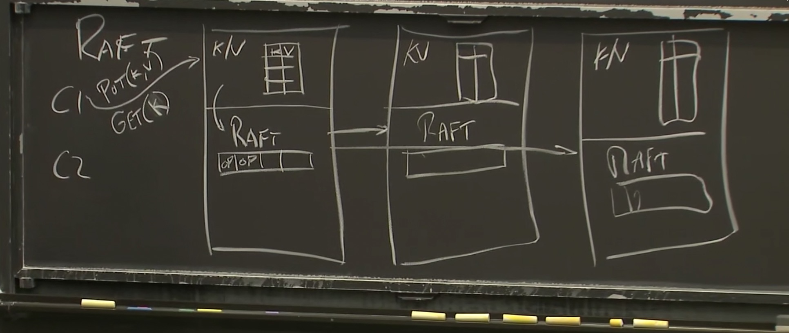

\# 理论部分

🪜：问题导向，保持思考

\## 基本概念

\### 三种节点类型
​

角色 leader主 candidate候选人 follower从，起始状态都是follower

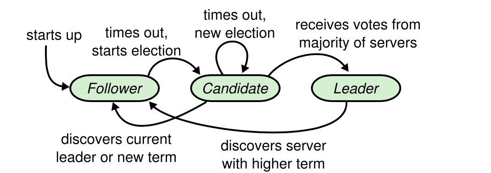

​

\### 几种定时器

几个定时器及超时时间

election time out 选举定时器时间，follower超过n未收到主的心跳，将自己切换为候选人开始选举（造反啦）

心跳定时器 heartbeat 主节点定期给follower发送心跳消息（老子还或者说给我老实点）

选举定时器，candidate 开始选举超过时间未成功选出leader，重新开启选举。

​

广播时间（broadcastTime） << 选举超时时间（electionTimeout） << 平均故障间隔时间（MTBF）

​

​

\### 一个随机时间

选举超时时间 150-300ms 避免来活锁

降低平分选票概率，但是仍然不可能

例子：A B C 几乎同时成为候选人，各自投自己一票，没人有拿到2票

\### 几种RPC
投票 请求/响应

追加日志 请求/响应

安装快照 请求/响应

成员变化（配置变更) 请求/响应

预选举 请求/响应

\### 状态机 state machine 及服务state
term是单调递增的

\*\*commitIndex\*\* 指log[] 数组坐标，已复制到多数从节点。

\*\*lastApplied\*\* 日志序列到状态机的位置

主节点修改commitIndex的前提是log 成功复制到大多数节点

follower节点根据主节点发送来的leaderCommit 修改
\> 1，如果commitIndex > lastApplied，则 lastApplied 递增，并将log[lastApplied]应用到状态机中（5.3 节）
\> 2.如果接收到的 RPC 请求或响应中，任期号T > currentTerm，则令 currentTerm = T，并切换为跟随者状态（5.1 节）

为了理解全部服务器规则2，拟人化比喻以下，假设桃花源出来的小华以为生活在清朝，当他遇到民国时期的人，他的认知也会提到民国，所有人都可交往的时候，大家都是一个term时代的人了。

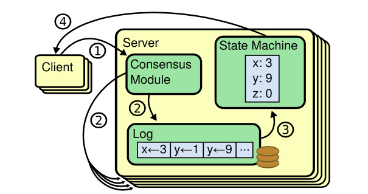

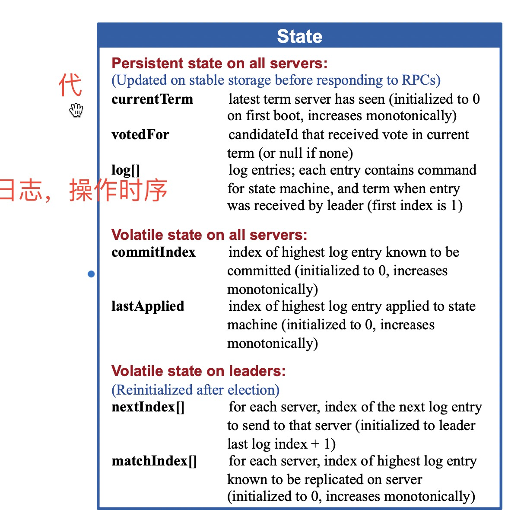

\## 日志复制的过程是怎么样的？

\*\*一般场景\*\*

主节点RPC从节点，复制日志，应用到状态机

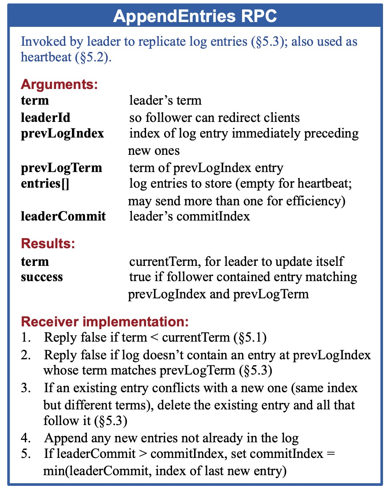
\> Leader为每个Follower维护一个nextId，标示下一个要发送的logIndex。Follower接收到AppendEntries之后会进行一些一致性检查，检查AppendEntries中指定的LastLogIndex是否一致，如果不一致就会向Leader返回失败。Leader接收到失败之后，会将nextId减1，重新进行发送，直到成功。这个回溯的过程实际上就是寻找Follower上最后一个CommittedId

\*\*主节点参数生成过程\*\*

主节点保存的 nextIndex[] matchIndex[]就是用来复制日志使用

preLogIndex,preLogTerm entries[]前面的日志term和index,用于从节点进行校验，就像一个链要扣上，举例：主节点日志[a,b,c,d,e,f]， 从节点日志[a,b,k] 发送entries:[ c,d] preLogIndex:b 从节点校验不会盲目接在k后面，而是检查到同样位置值冲突，k会被删除，接在b后面

nextIndex[]记录所有节点，下次请求需要携带的log位置 （初始值为领导人最后的日志条目的索引+1）

matchIndex[] 记录所有节点，已经复制到该服务器的最高日志条目的索引（初始值为0，单调递增）

复制请求及响应可能是并发的 。为了理解他们直接的必要性 举例：

主节点日志：[1，2，3，4，5，6]

从节点日志: [1,2]

此时matchIndex[从节点] = 1

请求1:[3,4] 请求2[5,6]

请求1处理成功后记录matchIndex[从]=3

\*\*​\*\*

\*\*接受者实现\*\*
\> 1\. 返回假 如果领导人的任期小于接收者的当前任期（译者注：这里的接收者是指跟随者或者候选人）（5.1 节）
\> 1\. 返回假 如果接收者日志中没有包含这样一个条目 即该条目的任期在 prevLogIndex 上能和 prevLogTerm 匹配上 （译者注：在接收者日志中 如果能找到一个和 prevLogIndex 以及 prevLogTerm 一样的索引和任期的日志条目 则继续执行下面的步骤 否则返回假）（5.3 节）
\> 1\. 如果一个已经存在的条目和新条目（译者注：即刚刚接收到的日志条目）发生了冲突（因为索引相同，任期不同），那么就删除这个已经存在的条目以及它之后的所有条目 （5.3 节）
\> 1\. 追加日志中尚未存在的任何新条目
\> 1\. 如果领导人的已知已提交的最高日志条目的索引大于接收者的已知已提交最高日志条目的索引（leaderCommit > commitIndex），则把接收者的已知已经提交的最高的日志条目的索引commitIndex 重置为 领导人的已知已经提交的最高的日志条目的索引 leaderCommit 或者是 上一个新条目的索引 取两者的最小值
\>
​

​

\*\*场景：新从节点加入\*\*

显然所有日志都复制一遍性能会很差

例如日志操作

x=1

x=2

x=3

都已提交

新节点加入时，最好直接复制x=3给它，这个就叫做快照snapshot，生成快照的过程叫做：log compaction 日志压缩，这里暂时不深入到这两个子问题。👀

快照中包含了最后索引的位置index和任期号term

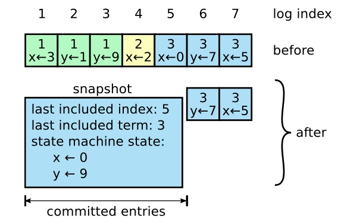

快照在主从分别执行，主要是为了节约存储空间。

\*\*​\*\*

\## 选举过程是怎么样的？

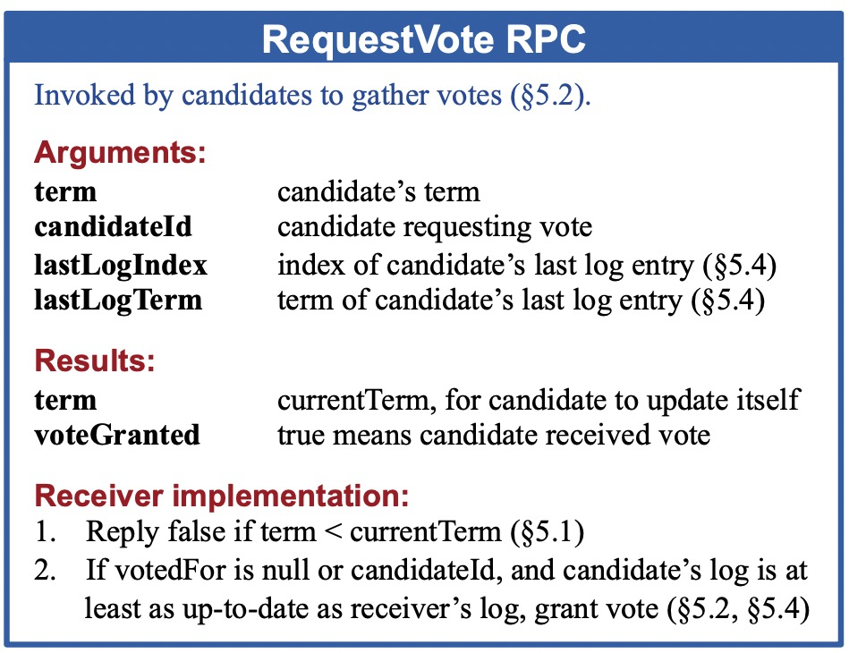
\> 1\. 如果now – lastLeaderUpdateTimestamp < elect\_timeout，忽略请求
\> 1\. 如果req.term < currentTerm，忽略请求。
\> 1\. 如果req.term > currentTerm，设置req.term到currentTerm中，如果是Leader和Candidate转为Follower。
\> 1\. 如果req.term == currentTerm，并且本地voteFor记录为空或者是与vote请求中term和CandidateId一致，req.lastLogIndex > lastLogIndex，即Candidate数据新于本地则同意选主请求。
\> 1\. 如果req.term == currentTerm，如果本地voteFor记录非空并且是与vote请求中term一致CandidateId不一致，则拒绝选主请求。
\> 1\. 如果lastLogTerm > req.lastLogTerm，本地最后一条Log的Term大于请求中的lastLogTerm，说明candidate上数据比本地旧，拒绝选主请求。

主能联系大多数（一半）才可用，不然客户端提交的请求无法提交，保证了强一致性

当主接收到term比当前的大时变成fllower

一个fllower不可能同时给两个候选者投票

一个从节点超时未接到主节点心跳变为候选term+1开始选举

​

比如客户端提交A存入100，

这里隐含的前提是节点肯定是有其他节点的地址的。

选出的新的主节点要包含老主节点的已提交的日志，这就对主节点提交有了要求

​

​

主节点退位时机 step down

​

\## 安全规则是什么？如果保证的？
所谓安全规则指的是对以上选举，日志复制添加的一些限制条件以保证下面5条Raft特性。
\> \- 选举安全特性Election Safety：给定Term下最多只有一个Leader被选举出来。

\> \- 领导人只附加原则Leader Append-Only：Leader不会覆盖或者是删除自己的Entry，只会进行Append。
\> \- 日志匹配原则Log Matching：如果两个Log拥有相同的Term和Index，那么给定Index之前的LogEntry都是相同的。
\> \- 如果两个Log拥有相同的Term和Index，那么他们拥有相同的内容
\> \- 如果两个Log拥有相同的term和Index，那么之前的Log也都是一样的
\> \- 领导人完整特性Leader Completeness：如果一条LogEntry在某个Term下被Commit了，那么这条LogEntry必然存在于后面Term的Leader中。
\> \- 状态机安全特性State Machine Safety：如果一个节点已经Apply了一条LogEntry到状态机，那么其他节点不会向状态机中Apply相同Index下的不同的LogEntry。

选举规则：领导人都必须存储所有已经提交的日志条目
\> Raft 使用投票的方式来阻止一个候选人赢得选举除非这个候选人包含了所有已经提交的日志条目。候选人为了赢得选举必须联系集群中的大部分节点，这意味着每一个已经提交的日志条目在这些服务器节点中肯定存在于至少一个节点上。如果候选人的日志至少和大多数的服务器节点一样新（这个新的定义会在下面讨论），那么他一定持有了所有已经提交的日志条目。请求投票 RPC 实现了这样的限制：RPC 中包含了候选人的日志信息，然后投票人会拒绝掉那些日志没有自己新的投票请求。

总结：投票逻辑加一个检查，候选者的日志比投票者更新（commitId) 投票者才会投赞成票

日志复制规则：领导人不删除自己的日志，只进行append

主节点写大多数节点成功commit

候选人index大于大多数节点index才能投票成功

主节点不删除自己的日志。

以上三点得出结论：

commit日志不会丢失。

老主节点未commitlog可能会被覆盖。

​

\## 为什么需要成员变化管理？

自动化处理配置改变。

试想一个场景，一个有三个节点 A B C ，主节点A，之后加入 E F ，在选举的时候，C E F 构成多数选举C为主，但是C可能没完全coomit老主已commit的日志，C复制给老主A日志的时候，冲突了。

​

解法1，新成员加入添加一个特殊日志标记，新主没应用完特殊标记（configration)E F不选他，主节点处理特殊标记，将之前的日志应用到新加入节点，之后commit特殊标记

解法2，

\## 为什么需要预选举？ 预选举的过程是怎样的？
\> 网络划分会导致某个节点的数据与集群最新数据差距拉大，但是term因为不断尝试选主而变得很大。网络恢复之后，Leader向其进行replicate就会导致Leader因为term较小而stepdown。这种情况可以引入pre-vote来避免。follower在转变为Candidate之前，先与集群节点通信，获得集群Leader是否存活的信息，如果当前集群有Leader存活，follower就不会转变为Candidate，也不会增加term。

匡扶汉室

​

ABC ED 分区 E开始选举总是失败，term+++，ABCED恢复之后ABCED又得重新选举，因为E日志落后太多还会失败。

先联系群众再组织群众。预选举和多数通信term不加。

​

​

\## 以容错的视角看问题？
主节点commit为来及apply到客户端（应用层）宕机了，之后选出了新的主节点，原先的主节点怎么办？新的主节点又是如何选出来的，又是如何保证不丢失原主节点commit的日志的？\*这个是最复杂的点。

\# 源码部分
etcd 实现 [https://github.com/etcd-io/etcd/tree/master/raft](https://github.com/etcd-io/etcd/tree/master/raft)

​

观其大要，先有整体的视角。

​

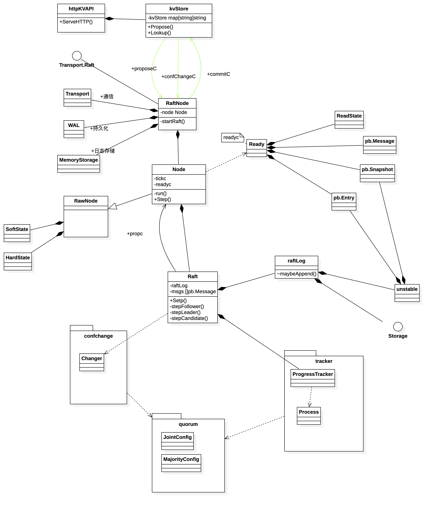

\## 背景知识
go channel

go http

etcd wal [WAL什么是 ](http://mysql.taobao.org/monthly/2017/03/02/) Write-Ahead Logging 先写日志，再写数据

\## 深入实现细节
​

\### 启动过程
构造channel

newRaftNode()=> 内部调用 startRaft()

-raft.StartNode =>内部调用.run 启动node事件循环[关键🌟]

-raftNode.serveRaft() 启动rafthttp 通信server

-raftNode.serveChannels() 启动持久化存储事件循环（等下层），启动httpAPI处理事件循环（等上层）

newKVStore 启动commit 事件循环

serveHttpKVAPI 启动httpAPI server

​

​

\###

\### PUT 处理过程
ServeHTTP=>

kvstore.Propose()=> 写proposeC

event loop in raftNode, node.Propose =>

node 内部调用 stepWait => stepWithWaitOption => 写propc

event loop in node, start by run ,raft.Step =>

raft 内部调用step 可能是stepLeader，stepFollower,stepCandidate

\|\> stepLeader raftLog.append()

event loop in node, start by run , =>readyc 写入 上层通过channel取出commit的

\###

​

\###

\### 消息类型
[参考](https://www.codedump.info/post/20180922-etcd-raft/#msgunreachable%E6%B6%88%E6%81%AF)

Message消息不仅是节点间通信的序列化数据封装

也是raft不同层（应用层-node-raft）调用的携带参数封装

​

\`\`\`
const (
 MsgHup MessageType = 0 //不用于节点间通信，仅用于发送给本节点让本节点进行选举
 MsgBeat MessageType = 1 //不用于节点间通信，仅用于leader节点在heartbeat定时器到期时向集群中其他节点发送心跳消息
 MsgProp MessageType = 2 //raft库使用者提议（propose）数据
 MsgApp MessageType = 3 //用于leader向集群中其他节点同步数据的消息 app=append简写
 MsgAppResp MessageType = 4
 MsgVote MessageType = 5 //节点投票给自己以进行新一轮的选举
 MsgVoteResp MessageType = 6
 MsgSnap MessageType = 7 // 用于leader向follower同步数据用的快照消息
 MsgHeartbeat MessageType = 8 //用于leader向follower发送心跳消息
 MsgHeartbeatResp MessageType = 9
 MsgUnreachable MessageType = 10 //用于应用层向raft库汇报某个节点当前已不可达
 MsgSnapStatus MessageType = 11 //用于应用层向raft库汇报某个节点当前接收快照状态
 MsgCheckQuorum MessageType = 12 //用于leader检查集群可用性的消息
 MsgTransferLeader MessageType = 13 //用于迁移leader
 MsgTimeoutNow MessageType = 14 //leader迁移时，当新旧leader的日志数据同步后，旧leader向新leader发送该消息通知可以进行迁移了
 MsgReadIndex MessageType = 15 //用于读一致性的消息
 MsgReadIndexResp MessageType = 16
 MsgPreVote MessageType = 17 // 节点投票给自己以进行新一轮的选举
 MsgPreVoteResp MessageType = 18
)
\`\`\`

\### 投票过程分析

\### leader 管理follower的状态
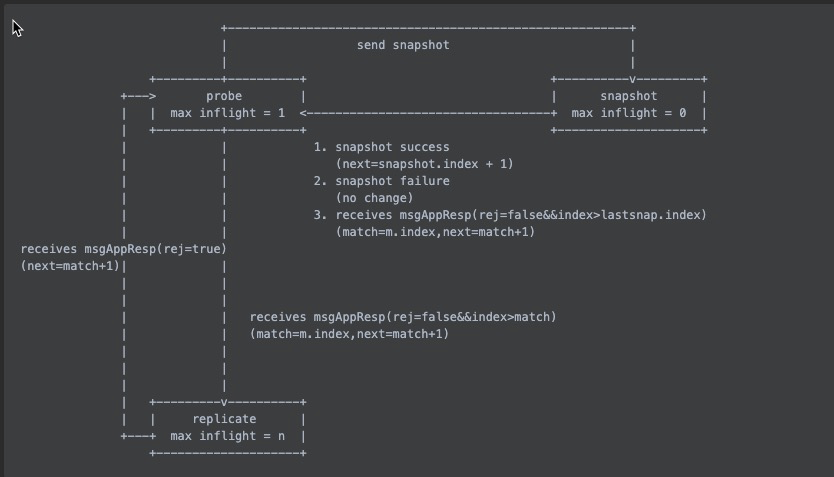

\### 设计模式体现
​

控制反转，storage接口

通信而不是共享内存 for事件循环 channel通信

层与层之间通过channel通信，select事件循环侦听channel

\# 总结

学习历程

纷繁复杂不可能事无巨细短时间内全部搞清楚,学习重点是什么？

概念（抽象），组件及关系，数据流

源码阅读

看文档，看使用，梳理高层次的组件关系，

弄懂单词的意思（单词->概念)

​

感悟

权利来自下层的支持而不是上层的授权

权利迭代的合法性总要有上一代的遗志

​

问题

所有请求都要有主节点参与，主节点会是个性能瓶颈，如果实现系统扩容是个问题？分区吗？

\# 学习资料
论文：

官方：[https://raft.github.io/](https://raft.github.io/)

简版 18页： [https://raft.github.io/raft.pdf](https://raft.github.io/raft.pdf) [斯坦福课件](https://web.stanford.edu/~ouster/cgi-bin/papers/raft-atc14) 🌟

完整版论文 258页：[https://web.stanford.edu/~ouster/cgi-bin/papers/OngaroPhD.pdf](https://web.stanford.edu/~ouster/cgi-bin/papers/OngaroPhD.pdf)

译文：

[https://www.infoq.cn/article/raft-paper](https://www.infoq.cn/article/raft-paper)

[https://github.com/maemual/raft-zh\_cn/blob/master/raft-zh\_cn.md](https://github.com/maemual/raft-zh\_cn/blob/master/raft-zh\_cn.md) 🌟

网络资源：

动画：

[http://thesecretlivesofdata.com/raft/](http://thesecretlivesofdata.com/raft/) 入门用

[https://github.com/klboke/raft-animation](https://github.com/klboke/raft-animation) 中文

视频 :

[MIT 6.824](https://www.bilibili.com/video/BV1R7411t71W?p=6) 🌟

[The Raft Protocol explained via SQL database \| CockroachDB \| consensus protocol](https://www.youtube.com/watch?v=k5BR9m8o9ec&ab\_channel=CockroachDB)

[Martin Kleppmann Distributed Systems 6.2: Raft](https://www.youtube.com/watch?v=IPnesACYRck&list=PLeKd45zvjcDFUEv\_ohr\_HdUFe97RItdiB&index=18)

[https://www.bilibili.com/video/BV1CK4y127Lj?spm\_id\_from=333.999.0.0](https://www.bilibili.com/video/BV1CK4y127Lj?spm\_id\_from=333.999.0.0)

BLOG:

[https://lessisbetter.site/tags/Raft/](https://lessisbetter.site/tags/Raft/)

其他：

[braft文档 ](https://github.com/baidu/braft/blob/master/docs/cn/raft\_protocol.md) 🌟

[一致性算法（Paxos、Raft、ZAB）bittiger](https://www.bilibili.com/video/BV1TW411M7Fx)

[ 32 etcd raft 源码阅读 【 Go 夜读 】](https://www.youtube.com/watch?v=sL02PsR20gE&t=423s&ab\_channel=TalkGo)

[字节跳动应用](https://www.infoq.cn/article/qpeIZNMPZvWv6V1L44xJ)

[sofa](https://www.sofastack.tech/projects/sofa-jraft/overview/)

[youtube搜索](https://www.youtube.com/results?search\_query=raft+algorithm)

[raft极客邦搜索](https://s.geekbang.org/search/c=0/k=raft%20algorithm/t=)

​

\# 英文词义对照

\`\`\`
consensus 一致看法，共识
rawNode 原始节点，被Node封装
softState 不持久化,hardState 持久化到存储
entry 存储日志的叫法有条目，账目，记录之意
propose 提议数据，客户端写数据
leader election 选举主节点
term 代
log replication 日志复制
safty 安全机制、保险
election timeout 选举超时时间
commitId 提交ID位
advance 向前移动
campaign 从事竞选活动

\`\`\`

