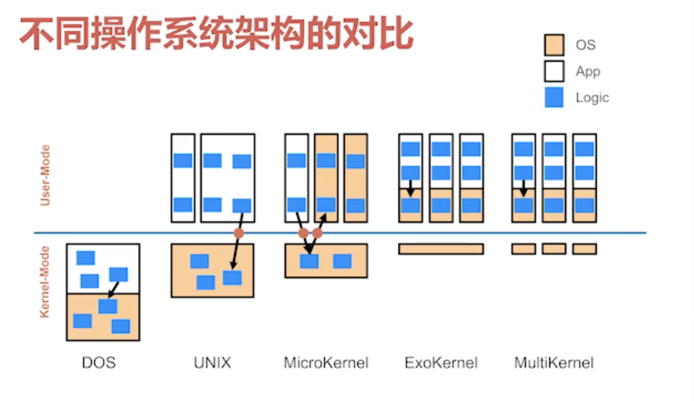
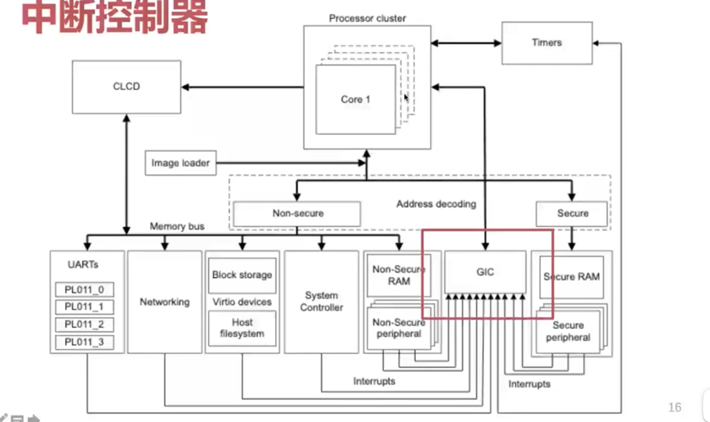
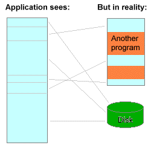
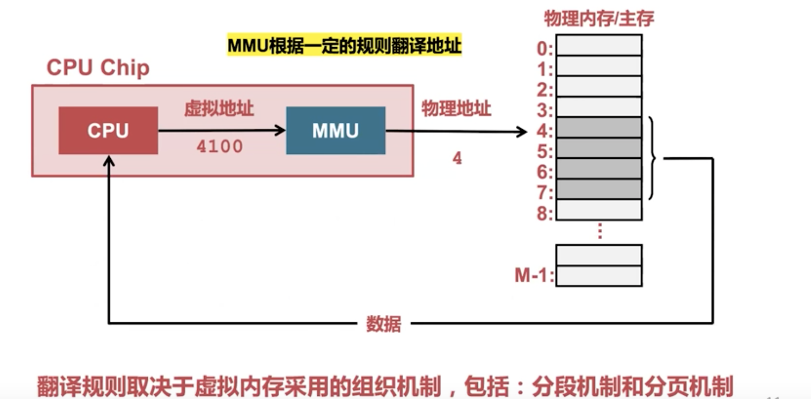
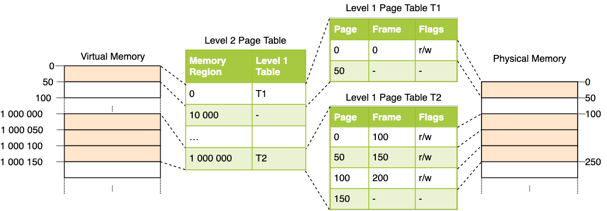

\# 历史
unix -自由-> GUN -没内核->Linux =>GUN库+Linux内核

自由软件 vs 开源

\#

\#

\# 操作系统架构

\# 

内核 -+系统库+GUN +=>linux发行版 （通常认为的操作系统

\#

\# 基础概念

\## 中断与异常
\*\*中断\*\*（英語：Interrupt）是指[處理器](https://zh.wikipedia.org/wiki/%E4%B8%AD%E5%A4%AE%E8%99%95%E7%90%86%E5%99%A8)接收到來自硬體或軟體的信號，提示發生了某個事件，應該被注意，這種情況就稱為中斷

\## 系统调用
\_软件中断\_。是一条CPU指令，用以自陷一个中断。由于软中断指令通常要运行一个切换CPU至[内核态](https://zh.wikipedia.org/w/index.php?title=%E5%86%85%E6%A0%B8%E6%80%81&action=edit&redlink=1)（Kernel Mode/Ring 0）的子例程，它常被用作实现[系统调用](https://zh.wikipedia.org/wiki/%E7%B3%BB%E7%BB%9F%E8%B0%83%E7%94%A8)（System call）。

系统调用是特殊的中断

\*\*系统调用\*\*（英语：system call），指运行在[用户空间](https://zh.wikipedia.org/wiki/%E4%BD%BF%E7%94%A8%E8%80%85%E7%A9%BA%E9%96%93)的[程序](https://zh.wikipedia.org/wiki/%E7%A8%8B%E5%BA%8F)向[操作系统](https://zh.wikipedia.org/wiki/%E6%93%8D%E4%BD%9C%E7%B3%BB%E7%B5%B1)[内核](https://zh.wikipedia.org/wiki/%E5%86%85%E6%A0%B8)请求需要更高权限运行的服务。系统调用提供用户程序与[操作系统](https://zh.wikipedia.org/wiki/%E6%93%8D%E4%BD%9C%E7%B3%BB%E7%B5%B1)之间的接口。大多数系统交互式操作需求在内核态运行。如设备IO操作或者进程间通信。

\# 内存管理
\*\*理解的关键在于：需要理解问题的出现及解决方案的演进\*\*

\*\*

\*\*ref:\*\*[https://blog.betacat.io/post/introduction-to-paging/](https://blog.betacat.io/post/introduction-to-paging/)

\### 虚拟内存

\*\*

\### 内存寻址过程
CPU->MMU-TLB页表缓存-> 总线-> 物理内存-> 可能？缺页->

分段，分页，多级页表

\### 分段
通过寄存器寻址，90年代几乎被淘汰

\### 分页
磁盘与内存传输最小单位一般是4k

\### 分页表 page table
操作系统在分页表中存储虚拟地址到物理地址的映射

\#### 多级页表
不需要未使用的空间创建1级页表，能省空间

\### 缺页
访问映射在虚拟地址空间但未加载到物理内存中，CPU发起中断，操作系统处理加载磁盘到内存

\### mmap
posix 标准系统调用
\> mmap是一种内存映射文件的方法，即将一个文件或者其它对象映射到进程的地址空间，实现文件磁盘地址和进程虚拟地址空间中一段虚拟地址的一一对映关系。实现这样的映射关系后，进程就可以采用指针的方式读写操作这一段内存，而系统会自动回写脏页面到对应的文件磁盘上，即完成了对文件的操作而不必再调用read,write等系统调用函数。相反，内核空间对这段区域的修改也直接反映用户空间，从而可以实现不同进程间的文件共享。

读写文件使用。将磁盘映射到虚拟内存，减少了内核态页缓存copy,效率高。

\# 进程与线程管理
进程process可以认为是线程thread的集合

\*\*线程\*\*（英语：thread）是[操作系统](https://zh.wikipedia.org/wiki/%E6%93%8D%E4%BD%9C%E7%B3%BB%E7%BB%9F)能够进行运算[调度](https://zh.wikipedia.org/wiki/%E8%B0%83%E5%BA%A6)的最小单位
\> 同一进程中的多条线程将共享该进程中的全部系统资源，如虚拟地址空间，[文件描述符](https://zh.wikipedia.org/wiki/%E6%96%87%E4%BB%B6%E6%8F%8F%E8%BF%B0%E7%AC%A6)和[信号处理](https://zh.wikipedia.org/wiki/%E4%BF%A1%E5%8F%B7%E5%A4%84%E7%90%86)等等。但同一进程中的多个线程有各自的[调用栈](https://zh.wikipedia.org/wiki/%E8%B0%83%E7%94%A8%E6%A0%88)（call stack），自己的[寄存器环境](https://zh.wikipedia.org/w/index.php?title=%E5%AF%84%E5%AD%98%E5%99%A8%E7%8E%AF%E5%A2%83&action=edit&redlink=1)（register context），自己的线程本地存储（thread-local storage）

\## 进程调度

\> \*\*完全公平调度器\*\*（英语：Completely Fair Scheduler，缩写为CFS）

\## 进程间通信
ref: [IPC](https://zh.wikipedia.org/wiki/%E8%A1%8C%E7%A8%8B%E9%96%93%E9%80%9A%E8%A8%8A)

匿名管道

有名管道

信号 signal

消息队列

共享内存

文件 （内存映射文件）

信号量 semaphore

sokect

本地套接字

\#### 本地套接字
不走网络协议栈

socket参数类型AF\_LOCAL

\#### 管道 pipe
一个定长的缓冲区

\# 锁

\# 文件系统

\# I/O 设备

\# 虚拟化

硬件虚拟化，操作系统虚拟化，软件虚拟化（虚拟机）

虚拟化->抽象层

磁盘虚拟化，网络虚拟化，IO虚拟化,CPU虚拟化

商业驱动

On-prmise -> lass -> CaaS->Paas ->FaaS

\## LXC
linux containers

利用内核功能实现操作系统层面虚拟化

主要技术有：namespace, chroot,cgroups

\# 网络

\*\*DPDK\*\*（英语：Data Plane Development Kit），是一组快速处理[数据包](https://zh.wikipedia.org/wiki/%E6%95%B0%E6%8D%AE%E5%8C%85)的开发平台及接口

因为内核中断及数据copy问题导致的效率低下，出现的新的解决方案

不中断，通过重写网卡驱动，数据来了写入内存，通过轮训处理数据，应用程序通过DPDK的接口读取数据包

\# 安全

\# 调试器