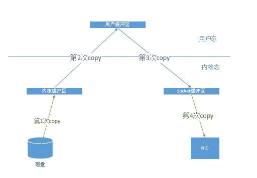
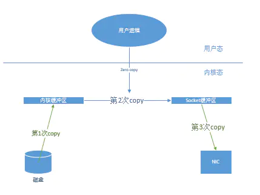
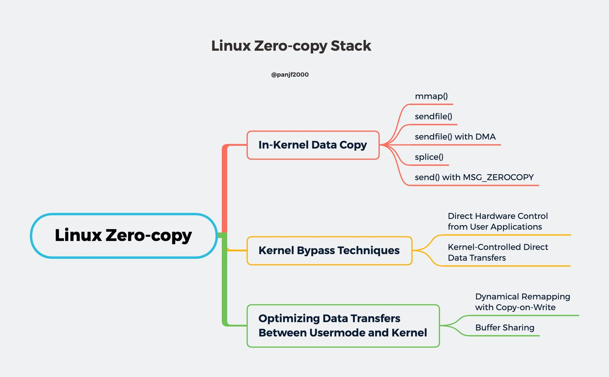

\## 虚拟内存技术

虚拟内存 （隔离进程对相同物理内存的访问，

操作系统完成由虚拟内存地址到真实内存地址或者磁盘地址之间的映射工作

分段 -\> 分页

虚拟内存和物理内存的映射通过页表(page table)来实现。每个进程都有自己的页表

\## zero copy 技术
[https://zhuanlan.zhihu.com/p/308054212](https://zhuanlan.zhihu.com/p/308054212)

原：

通过操作系统API实现的零拷贝

DMA 全称是 Direct Memory Access，也即直接存储器存取

磁盘到内存的COPY 不需要CPU参与

通过DMA 控制器 copy

如果用户进程不需要对数据传输过程中的数据进行修改才适用

sendfile 需要硬件要求-> splice

\## IO

[https://zhuanlan.zhihu.com/p/353692786](https://zhuanlan.zhihu.com/p/353692786)

阻塞与异步

blocking IO= 硬件->内核为就绪阻塞

异步IO=硬件->内核 + 内核到用户态 都不阻塞，即内核到用户态不需要用户主动调用

演化过程：

BIO

▼

NIO（non-blocking IO) recv不阻塞了,用户态遍历

▼

NIO select/poll 多路复用 传递fd内核态遍历

▼

NIO epoll第二版多路复用 内核态红黑树维护fd集合

▼

window的IOCP是目前唯一的异步IO即AIO

非阻塞IO优点 \*\*一个线程可以处理多个连接 (一直通过系统调用询问是否就绪\*\*

\*\*

\*\*IO 多路复用：复用的是系统调用，批量查询多个是否就绪，读取就绪的\*\*

\*\*FD =文件描述符\*\*（File descriptor）

\### select
调用后阻塞，直到超时

单个进程能够监视的文件描述符的数量存在最大限制 = 1024

selectAPI
\`\`\`
// readfds:关心读的fd集合；writefds：关心写的fd集合；excepttfds：异常的fd集合
int select (int n, fd\_set \*readfds, fd\_set \*writefds, fd\_set \*exceptfds, struct timeval \*timeout);
\`\`\`

\### poll
pollfd 并没有最大数量限制（但是数量过大后性能也是会下降）

\`\`\`
int poll (struct pollfd \*fds, unsigned int nfds, int timeout);
struct pollfd {
 int fd; /\* file descriptor \*/
 short events; /\* requested events to watch \*/
 short revents; /\* returned events witnessed \*/
};
\`\`\`

缺点：需要copy 海量fd集合

\### epoll

\## 服务器IO模型
reactor 单线程/多线程

event loop 是一种程序结构 设计方法