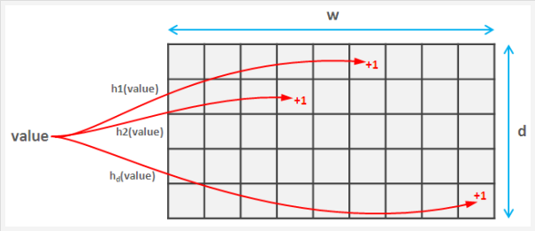

time sliding 和 sliding还是不同的

搜索关键词：top-k sliding time window

应用场景： 热搜榜，最近n时间内访问最高的IP，trending趋势

论文：[https://github.com/Seven4X/paper/tree/main/top-k](https://github.com/Seven4X/paper/tree/main/top-k)

复杂度加码：filter 地区filter，性别filter，topic-filter

上升趋势 or 下降趋势

\# count min sketch
xxxxxx 32

yyzzxx 32

\# 堆
minheap 最小值堆

资料 [https://www.bilibili.com/video/BV1cy4y1q7P1](https://www.bilibili.com/video/BV1cy4y1q7P1)

\# 滑动窗口
循环队列资料：[https://leetcode-cn.com/problems/design-circular-queue/solution/she-ji-xun-huan-dui-lie-by-leetcode/](https://leetcode-cn.com/problems/design-circular-queue/solution/she-ji-xun-huan-dui-lie-by-leetcode/)

sub-window

output:[https://www.bilibili.com/video/BV1t5411K7hR?](https://www.bilibili.com/video/BV1t5411K7hR?)