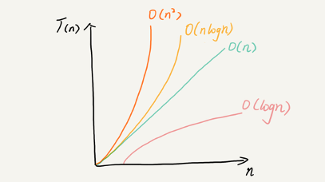
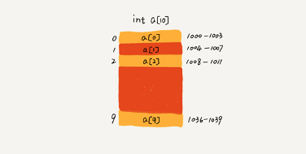
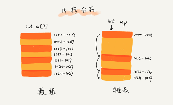
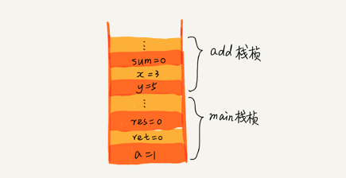
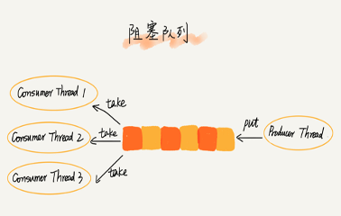

\# 1.时间空间复杂度

忽略常量

数据量增长趋势->代码执行次数=时间复杂度

数据量->占用空间 =空间复杂度

最好情况时间复杂度

最坏情况时间复杂度

平均时间复杂度

\# 2.数组

一段连续的内存空间

支持随机访问，根据下标随机访问时间复杂度 O(1)

a[k]\_address = base\_address + k

\*type\_size

操作技巧1：添加x

1讲目标位数据挪到最后

2 讲x添加到目标位

操作技巧2：删除a,b,c

批量一起删除减少挪动

JVM标记清除算法

\# 3.链表
单向链表

双向链表：根据位置能插入删除复时间杂度O(1)

循环链表

常规操作（考点）

1.单链表反转

2.链表中环的检测

3.两个有序的链表合并

4.删除链表倒数第 n 个结点

5.求链表的中间结点

利用哨兵简化实现难度

还能极致优化，但是代码阅读性降低

\# 4.栈

操作受限的线性表，后进先出

应用

1.括号匹配

2.函数调用

3.表达式求值

4.两个栈实现浏览器前进后退

\# 5.队列
操作受限线性表，先进先出

循环队列  Disruptor

阻塞队列

\# 6.递归
去的过程：递

回的过程：归

适用问题类型：

1 一个问题的解可以分解为几个子问题的解

2 这个问题与分解之后的子问题，除了数据规模不同，求解思路完全一样

3 存在递归终止条件

思路：

1 找到大问题拆解成小问题的公式

2 找到终止条件

缺点：

堆栈溢出

重复计算

死循环

n个阶梯 每次1或2步 一共有几种走法？

int f(int n) {

  if (n == 1) return 1;

  if (n == 2) return 2;

  return f(n-1) + f(n-2);

}

会有重复计算的问题，可以使用Hash缓存结果

非递归实现

int f(int n) {

  if (n == 1) return 1;

  if (n == 2) return 2;

  int ret = 0;

  int pre = 2;

  int prepre = 1;

  for (int i = 3; i <= n; ++i) {

    ret = pre + prepre;

    prepre = pre;

    pre = ret;

  }

  return ret;

}