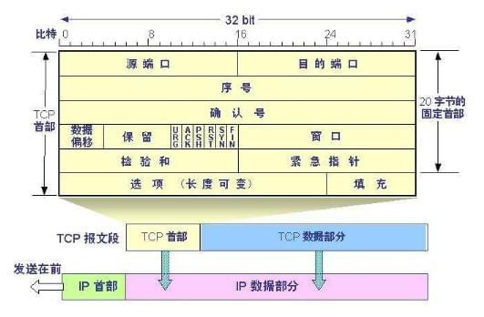

\# TCP

\## 格式

确认号=序号+数据长度，\*\*连续\*\*正确接受的最高位

数据偏移：占4位，偏移量按照4字节来算，四字节表示最大数=2^4-1=15 15\*4字节=60字节为一个tcp最大数据传输量

\## 连接

为什么3次？

如果两次会出现已丢失的握手请求扰乱。

为什么4次？

不一定四次，ACK，FIN可以一起返回

\### 建立[握手](https://zhuanlan.zhihu.com/p/199284611)
client syn seq=x

server syn seq=y ack=x+1 两个信息合成一个报文

client ack=y+1

\### 断开连接

http server场景主动关闭连接方是server

client fin seq=x ack=y 我要关闭

server ack x+1 fin =y 收到关闭请求，关闭 也可以同时返回

client ack=y+1 收到关闭请求

两个wait

\*\*close\_wait\*\* \*\*time\_wait\*\*

主动关闭方收到FIN包后 进入TIME\_WAIT

被关闭方回复\_主动方FIN的ACK\_后进入CLOSE\_WAIT

\### time\_wait
=2MSL（2倍的max segment lifetime） 实践值=1分钟

为了防止出现连接（五元组）复用时有重传数据包导致错误接收 =>rest发生 [blog](https://www.cnblogs.com/kevingrace/p/9988354.html)

保证对端能够断开连接

\### close wait
close\_wait = wait app close

等待应用层close => 应用程序资源泄漏

\## 可靠传输
数据段确认机制

数据重传机制，快速重传机制\*\*Fast Retransmit\*\* （根据数据ack判断）

选择性确认\*\*Selective Acknowledgment\*\*：避免301超时导致401，501也超时重传，利用option区交换确认信息

\## 流量控制 flow control

机遇报文中的窗口大小=物理窗口-buffer占用

\## [拥塞控制](https://zhuanlan.zhihu.com/p/144273871) congestion control
应用bbr作为拥塞控制算法：

sysctl -w net.ipv4.tcp\_congestion\_control=bbr

\### 基于流量的控制
速率控制方法

\*\*超时，3个ACK \*\*作为控制手段

从1MMS开始

每次翻倍 2指数增加

 遇到超时 减到1MMS 指数增加，增加的阈值再线性增加

 如果3个冗余ACK 从一半开始然后再+1MMS

如果遇到超时记录当前窗口的一般作为阈值

慢启动阶段SS 指数增加

拥塞避免阶段CA 线性增加

锯齿状图形

特点：初始速率慢，但是指数加倍，长期来看可以忽略

3/4 \* W/RTT =吞吐量

\# 操作系统参数

tcp\_synack\_retries 配置重试次数

tcp\_max\_syn\_backlog syn连接数

tcp\_abort\_on\_overflow

\*\*tcp\_tw\_reuse 根据时间戳大小判断是否重用\*\*

\*\*tcp\_tw\_recycle\*\*

tcp\_timestamps