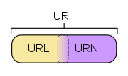

\# 历史演化

http/0.9 单行协议

->http/1.0 构建扩展性，加头

->http/1.1 标准化 ，连接复用，+缓存控制，+内容协商

 ->https ssl->tls 安全

 ->websocket 双工

 -\> rest 构建复杂应用

->http/2 性能 二进制，复用协议，压缩headers，服务端团队

\## 常见状态码

301 永久重定向

302 Found ->Location 临时重定向

403 \*\*\`Forbidden\`\*\* 服务端有能力处理，阿里使用流控状态码

429 Too Many Requests -> Retry-After 正经流控

502 网关调用的服务响应无效

503 网关调用的服务不可用

504 网关调用的服务超时

URL

\# 交互手段

polling ->long polling （手段）-> Server-Sent Events (h5功能）->websocket （协议）

网关多路复用维持会话，

\#