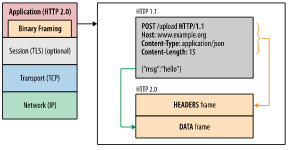
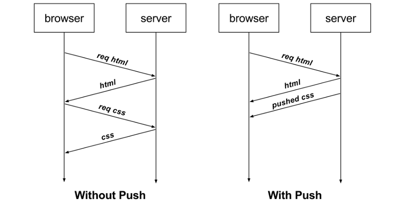

ref:

[https://developers.google.com/web/fundamentals/performance/http2](https://developers.google.com/web/fundamentals/performance/http2)

google's SPDY协议-标准化>http2

基于tcp

google's QUIC-标准化>http/3

基于udp

\## 特点

二进制分帧层：指的是位于套接字接口与应用可见的高级 HTTP API 之间一个经过优化的新编码机制

请求与响应复用

将 HTTP 消息分解为独立的帧，交错发送，然后在另一端重新组装是 HTTP 2 最重要的一项增强

请求优先级

头部压缩

服务端推送

一次请求，多个点响应

\##

\## Chrome离线通知