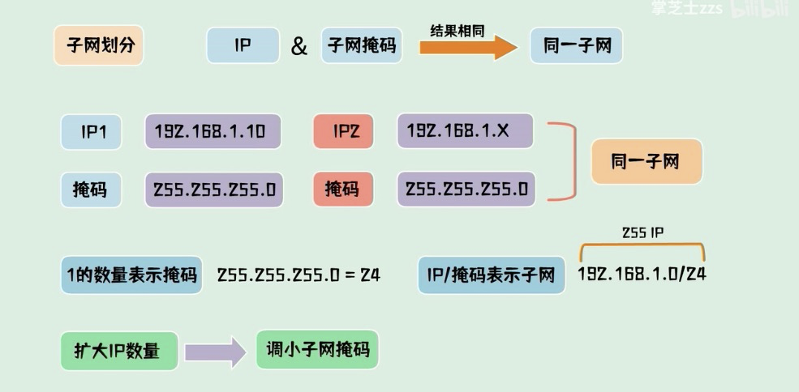
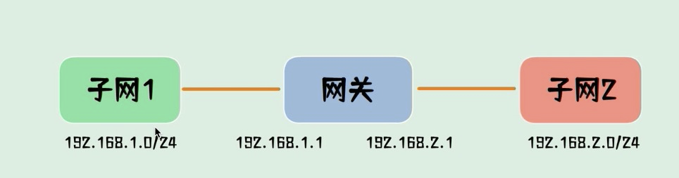

交换机

数据链路层设备 只关注MAC地址 不关注IP

有端口 和 MAC地址对应表

内网设备

路由器

有WAN口和LAN口，如果取掉WAN口只使用LAN口 路由器is交换机

网关

连接两个网络的设备 可以是路由器

\`

\`

[https://www.bilibili.com/video/BV1fU4y1t7Ju?from=search&seid=7229162837882316580](https://www.bilibili.com/video/BV1fU4y1t7Ju?from=search&seid=7229162837882316580)

tcp/ip 协议规定不同子网不能直接通信

