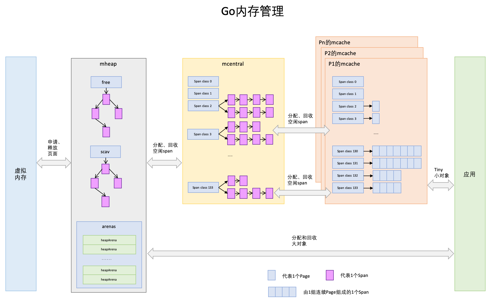
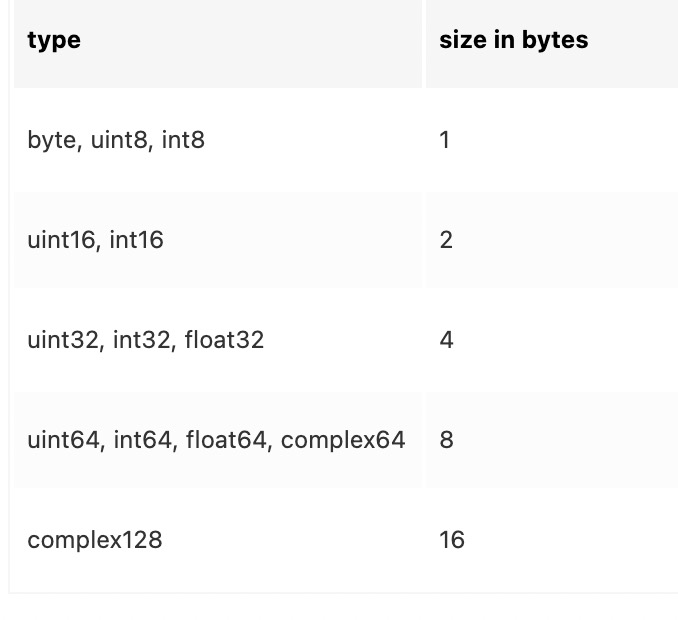
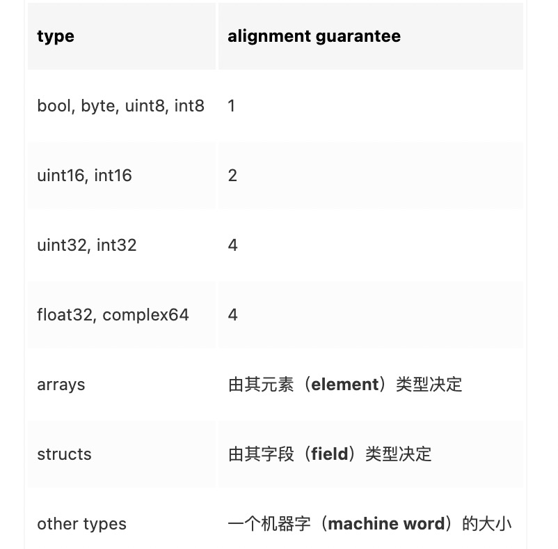
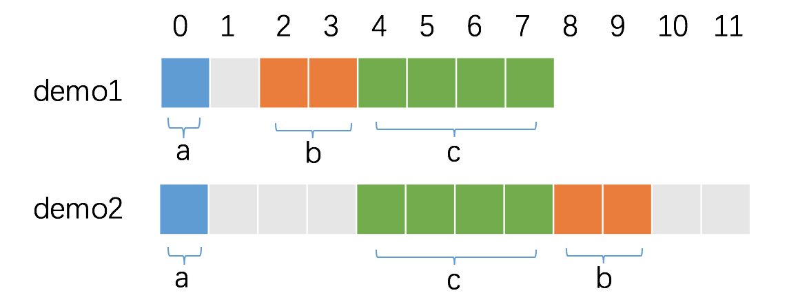
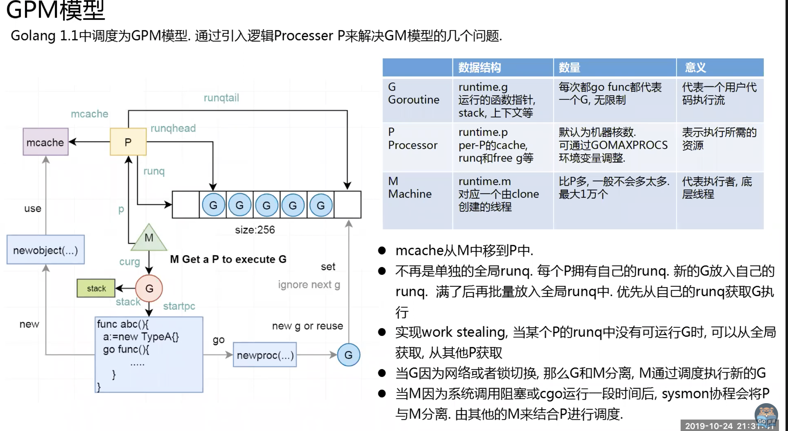
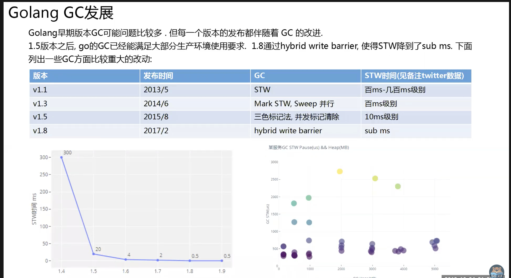

# 内存分配
自顶向下

虚拟内存->mheap->mcentral->mcache

mheap持有mcentral,heapArena
```go
mheap {
 allspans []\*mspan // 所有申请的span 可能为了dump方便
 arenas [1 << arenaL1Bits]\*[1 << arenaL2Bits]\*heapArena //map结构 元信息+mspan
 central [numSpanClasses]struct {
 mcentral mcentral
 pad [cpu.CacheLinePadSize - unsafe.Sizeof(mcentral{})%cpu.CacheLinePadSize]byte
 }

 alloc(){//申请span 维护在allspans中
 系统调用
 }
}

heapArena{
 bitmap [heapArenaBitmapBytes]byte
 spans [pagesPerArena]\*mspan

}

mcentral {
 spanclass spanClass
 partial [2]spanSet // list of spans with a free object
 full [2]spanSet // list of spans with no free objects
 grow(){
 ref:mheap.alloc() 向mheap申请span
 }
}

mspan {
 next \*mspan // next span in list, or nil if none
 prev \*mspan // previous span in list, or nil if none
 startAddr uintptr // 起始地值
 npages uintptr // number of pages in span
}

mcache { //P初始化初始化alloc是通过mheap\_.cachealloc.alloc()这样这块span mheap没有进行管理
 alloc [numSpanClasses]\*mspan
 refill(){ 向central申请span
 ref:mheap.central
 }
}

```


[内存占用：](https://studygolang.com/articles/33757?fr=sidebar)
\> Go 1.15版本时，我们可以通过GODEBUG=madvdontneed=1让Go runtime使用MADV\_DONTNEED替代MADV\_FREE达到更积极的将不用的内存释放给OS的效果(如果使用MADV\_FREE，只有OS内存压力很大时，才会真正回收内存)，这将使得通过top查看到的常驻系统内存(RSS或RES)指标更实时也更真实反映当前Go进程对os内存的实际占用情况(仅使用linux)。

1.6改回MADV\_FREE->MADV\_DONTNEED

## 内存对齐

为了减少CPU读取内存次数，CPU根据字长读取（批量读取）32位读取4字节 64位读取8字节

同时保证读取的原子性

理解：对齐指的是向上一位对齐保证前面的空间～对齐位置必须有当前类型的大小保证大小。

比如当前字段类型为

大小保证 size guarantee



对齐保证 align ~



struct每个字段对其数的最大值

对于 struct 结构体类型的变量 x，计算 x 每一个字段 f 的 \`unsafe.Alignof(x.f)\`，\`unsafe.Alignof(x)\` 等于其中的最大值。

例子：通过 小->中->大 减少内存空间占用
```
type demo1 struct {
 a int8
 b int16
 c int32
}

type demo2 struct {
 a int8
 c int32
 b int16
}

func main() {
 fmt.Println(unsafe.Sizeof(demo1{})) // 8
 fmt.Println(unsafe.Sizeof(demo2{})) // 12
}
```


# GPM调度


![[Pasted image 20220310122142.png]]

# GC

