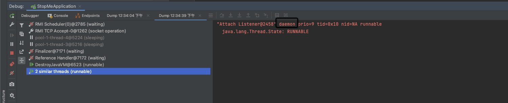

# 示例程序
源码：[https://github.com/seven4x/graceful-shutdown-me](https://github.com/seven4x/graceful-shutdown-me)
```
producer 每秒中向阻塞队列中以阻塞的方式put元素
consumer 每2秒钟向阻塞队列中以阻塞的方式take元素
势必在需要关闭时queue中存在未消费万的元素
LongTimeJob，LongTimeJob2 是一个类无限永远执行不完的任务 作为对照

MyWorker 分别启动用四个线程执行以上四个任务
同时通过@PreDestroy注册了spring容器销毁MyWoker回调
在回调中关闭线程池可分别调用shutdown()与shutdownNow()查看区别（因素1）
通过Runtime.addShutdownHook 注册了进程退出回调
spring相关参数，可使用 server.shutdown=graceful或默认值 分别切换（因素2） 观察表现。

```

在 MyWoker.`stop()` 方法中 我们需要通过持续判断队列是否消费完成，保证main 线程（守护daemon线程)不退出，保证consumer线程能执行完，这些控制是为了达到业务目标（消费个数=生产个数）。

# 何为关闭
可以理解进程是操作系统对一系列资源使用权的抽象

进程由操作系统调度

设计上操作系统可以直接释放进程持有的资源不加任何告知，或通知进程给继续使用一段时间资源的机会

这里的通知就是信号Singal 进程间通信的其中一种方式。

这里我们就只关注两个信号 `kill -2` `kill -9` 其中 `kill -2` 给 进程能够优雅退出的机会， `kill -9` 信号也会发给进程，但是进程没有继续使用资源的机会了。

即使进程是运行在容器里也是相同的机制，docker container kill -2 也是传递信号给JVM进程

# 何为优雅
也有的地方翻译成体面

程序上理解为主动释放进程持有的资源比如连接池，或者做些业务操作比如flush

在实例程序中等同于producer生产的所有元素需要consumer完全消费完，实际项目中尽量避免这样的设计，进程最好是能够被随时kill -9的，无状态的。

# 通过 kill -2 方式
hook调用入口 `java.lang.ApplicationShutdownHooks` 其中存在spring注册的Hook
```
 //org.springframework.context.support.AbstractApplicationContext
 @Override
 public void registerShutdownHook() {
 if (this.shutdownHook == null) {
 // No shutdown hook registered yet.
 this.shutdownHook = new Thread(SHUTDOWN_HOOK_THREAD_NAME) {
 @Override
 public void run() {
 synchronized (startupShutdownMonitor) {
 doClose();
 }
 }
 };
 Runtime.getRuntime().addShutdownHook(this.shutdownHook);
 }
 }


```
在spring容器销毁Bean的过程中会调用到MyWoker @PreDestroy标注的 `clean()` 方法

consumer producer进程因为while (!queue.isEmpty()) 控制逻辑能够优雅退出

LongTimeJob会被打断退出

## `server.shutdown=gracefual 作用`
`server.shutdown` 只控制和tomcat相关的即http请求是否处理完成。

模拟过程

curl http://localhost:8080/block

kill -2 pid

观察日志,发现一个事实时tomcat会先尝试优雅关闭，因为/block请求一直没有完成，超过30000ms 会强制关闭。
```
2021-06-28 13:14:10.411 INFO 10619 --- [ionShutdownHook] o.s.b.w.e.tomcat.GracefulShutdown : Commencing graceful shutdown. Waiting for active requests to complete
.....
2021-06-28 13:14:40.417 INFO 10619 --- [ionShutdownHook] o.s.c.support.DefaultLifecycleProcessor : Failed to shut down 1 bean with phase value 2147483647 within timeout of 30000ms: [webServerGracefulShutdown]
2021-06-28 13:14:40.437 INFO 10619 --- [tomcat-shutdown] o.s.b.w.e.tomcat.GracefulShutdown : Graceful shutdown aborted with one or more requests still active

```

# 通过System.exit方式
通过System.exit也会触发hook，注意退出代码需要在新线程中执行，非此springmvc无法正确返回响应内容

# 通过actuator/shutdown 方式
实现类：org.springframework.boot.actuate.context.ShutdownEndpoint

只是关闭Spring容器
```
 private void performShutdown() {
 try {
 Thread.sleep(500L);
 } catch (InterruptedException var2) {
 Thread.currentThread().interrupt();
 }

 this.context.close();
 }
```

## 与kill -2 的区别
如果我们在示例程序中通过shutdown()关闭线程池的前提下，通过kill -2 进程也能退出，其表现是：producer consumer完成业务目标“安全”退出，LongTimeJob运行中的线程会被直接忽略，进程退出。

在通过 actuator/shutdown退出时进程无法退出，因为没有信号量传给进程，JVM中的其他守护线程没有能主动退出（见截图），因为有守护进程存在longtimejob进程也就没有退出。



于是可以总结为：actuator/shutdown如果遇到类似死循环导致的线程无法退出，actuator/shutdown关闭不了进程。

# 最佳实践
尝试安全退出，如果超过n秒之后没有退出，进行强制退出

在k8s的API设计中和spring `server.shutdown=graceful` 的设计都是这种思想。