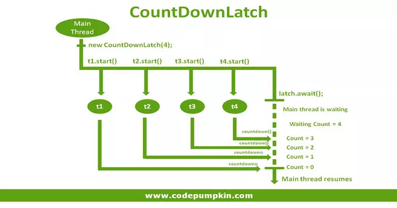
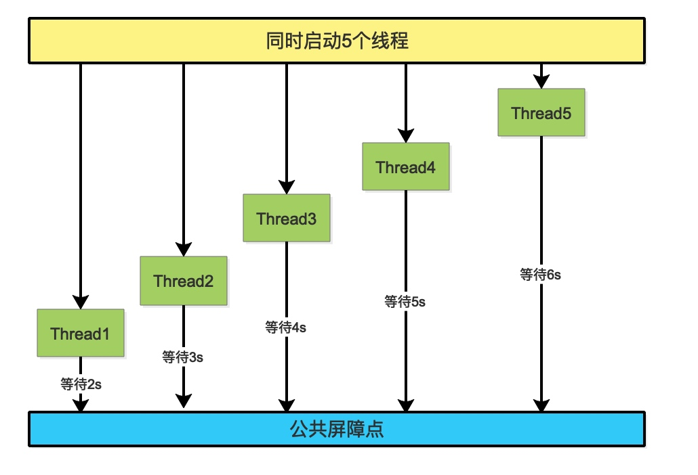
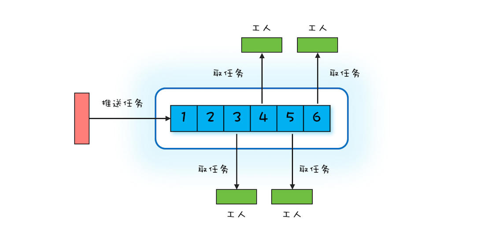

\*\*并发编程可以总结为三个核心问题：分工、同步、互斥\*\*

\*\*

\# 理类基础

缓存导致的可见性问题，线程切换带来的原子性问题，编译优化带来的有序性问题

double check 单例模式仍然存在空指针异常问题

Happens-Before \*\*前面一个操作的结果对后续操作是可见的\*\*

1\. 顺序性：一个线程中，按照程序顺序，前面的操作 Happens-Before 于后续的任意操作
1\. volatile变量：对一个volatile变量的写操作， Happens-Before 于后续对这个volatile变量的读操作。
1\. 传递性：如果A Happens-Before B，且B Happens-Before C，那么A Happens-Before C
1\. 锁：对一个锁的解锁 Happens-Before 于后续对这个锁的加锁
1\. 线程启动：它是指主线程A启动子线程B后，子线程B能够看到主线程在启动子线程B前的操作。
1\. join()：主线程A等待子线程B完成（主线程A通过调用子线程B的join()方法实现），当子线程B完成后（主线程A中join()方法返回），主线程能够看到子线程的操作

死锁：\*\*一组互相竞争资源的线程因互相等待，导致“永久”阻塞的现象\*\*

\*\*出现死锁的条件：\*\*

1\. 互斥，共享资源X和Y只能被一个线程占用；
1\. 占有且等待，线程T1已经取得共享资源X，在等待共享资源Y的时候，不释放共享资源X；
1\. 不可抢占，其他线程不能强行抢占线程T1占有的资源；
1\. 循环等待，线程T1等待线程T2占有的资源，线程T2等待线程T1占有的资源，就是循环等待。

 打破2or3or4解决死锁

1 同时申请释放资源

2 按顺序id排序申请资源

3 超时释放

等待wait通知notify

wait干掉了循环等待

wait与sleep的区别

都是让渡CPU时间

wait必须在sync中使用，wait释放持有锁

\*\*竞态条件，指的是程序的执行结果依赖线程执行的顺序\*\*

\*\*活锁：太谦让没有线程获得锁执行，解：等待随机时间\*\*

\*\*饥饿：某线程得不到调度，锁占用事件太长，解：公平锁\*\*

\*\*

锁原理：

[https://www.cnblogs.com/binarylei/p/12544002.html](https://www.cnblogs.com/binarylei/p/12544002.html)

MESA 模型

线程状态：

最佳线程数=CPU核数 \* [ 1 +（I/O耗时 / CPU耗时）]

\# 并发工具类

\## ReentrantLock
与synchronized的区别，sync会一直死等，破坏不可抢占条件

ReentrantLock通过在加锁释放锁的时候修改内部volatile关键字实现可见性

ReentrantLock

可重入锁 sync ,reentrantLock

公平锁：ReentrantLock 参数fair

非公平锁 ReentrantLock默认

利用Condition 达成异步转同步

\`private final Condition condition = lock.newCondition();\`

\- \`await()\`会释放当前锁，进入等待状态；

\- \`signal()\`会唤醒某个等待线程；

\- \`signalAll()\`会唤醒所有等待线程；

\- 唤醒线程从\`await()\`返回后需要重新获得锁。

\## Semaphore
\*\*可以允许多个线程访问一个临界区.\*\*

\_信号量可以实现的独特功能就是同时允许多个线程进入临界区，但是信号量不能做的就是同时唤醒多个线程去争抢锁，只能唤醒一个阻塞中的线程，而且信号量模型是没有Condition的概念的，即阻塞线程被醒了直接就运行了而不会去检查此时临界条件是否已经不满足了，基于此考虑信号量模型才会设计出只能让一个线程被唤醒，否则就会出现因为缺少Condition检查而带来的线程安全问题。正因为缺失了Condition，所以用信号量来实现阻塞队列就很麻烦，因为要自己实现类似Condition的逻辑。\_

\_

\## CountDownLatch 倒数门插

构造参数设置计数器

countDown() 方法减数

await() 阻塞减为0时执行

\## CyclicBarrier 循环屏障
构造函数设置计数 和回调

await() 调用次数 达到计数，可以执行await后的代码，同时执行回调

自动重置计数

\## 并发容器

\_

\## 原子类

操作系统支持CAS指令

compare and swap

CAS+自旋 =无所原子操作

\## 线程池
线程池执行过程？

Java中的线程池是生产消费模型

ThreadPoolExecutor使用太麻烦所以才有了Excutors工具类辅助创建线程池

\## Future
like 提货单

RunnableFuture FutureTask

适用于 A 长耗时 B短耗时 A依赖B完成 A需要B的引用

\## CompletableFuture
异步编程 then

java9 Flow

执行完A执行B

\## ExecutorCompletionService
\*\*批任务使用线程池处理，并且需要获得结果，但是不关心任务执行结束后输出结果的先后顺序\*\*

同时执行A，B，C 只要一个执行完成就能get

区别于ThreadPoolExecutor

应用： Forking Cluster，p2p文件块批量下载。

\## Fork/Join
分支思想

论文：[http://gee.cs.oswego.edu/dl/papers/fj.pdf](http://gee.cs.oswego.edu/dl/papers/fj.pdf)

通过ForkJoinPool创建线程池，通过invoke调用ForkJoinTask

ForkJoinTask子类：RecursiveAction 没有返回值 ,RecursiveTask有返回值

\# 设计模式

\## 互斥、同步：

\### 1 Immutability

\### 2 Copy-on-Write
延迟策略，写的时候才复制

\### 3 不共享
ThreadLocal+线程池=内存泄漏

线程池不释放，ThreadLocal中的Value无法被GC。解：手动remove

ThreadLocal不释放，Entry key是弱引用被回收，value没法回收

Thread->ThreadLocal->ThreadLocalMap->Entry

Entry为软引用WeakReference

\### 4 Guarded Suspension
等待唤醒机制的封装

保护性暂挂，Guarded Wait模式、Spin Lock模式，多线程版本的if

源码阅读：dubbo DefaultFuture

get里wait

onChange里notify

\### 5 Balking模式
Balking Pattern用于防止对象在不完整或不适当的情况下执行某些代码。

synchriozed 快速失败。

\## 分工模式：

\### 1 Thread-Per-Message
协程创建轻快完全可以干掉线程池方式的

\### 2 Worker Thread模式

\*\*提交到相同线程池中的任务一定是相互独立的，否则就一定要慎重\*\*。

\### 3 生产者-消费者模式

削峰填谷，批量消费

\## 如何优雅的终止线程？

\## 如何优雅的终止线程池？
shutdown() 拒绝接受任务，原来的会执行完

shutdownNow()

拒绝任务，中断正在执行，将队列中的通过参数返回

\## 如何优雅的终止进程？

\## 如何优雅的终止docker容器？

\# 他山之石

\## Actor并发模型
akka scala

\## 软件事务内存（Software Transactional Memory，简称STM
仿照数据库MVCC（Multi-Version Concurrency Control）多版本并发控制

开源实现：[https://github.com/pveentjer/Multiverse](https://github.com/pveentjer/Multiverse)

\## Coroutine 协程
协程 用户态调度

线程 内核态调度

go

Java Loom

\## CSP模型Communicating Sequential Processes

\# 总结

