[教程地址](https://www.bilibili.com/video/BV1pi4y1P76P?p=13&spm\_id\_from=pageDriver)

​

\# 环境搭建
[https://www.dosbox.com/download.php?main=1](https://www.dosbox.com/download.php?main=1)

​

​

\### ​

\# 基础知识
地址总线，数据总线，控制总线

​

字 和字节

字节=8bit

字=cpu 8086是16bit

​

​

汇编器：[wiki](https://zh.wikipedia.org/wiki/%E7%B5%84%E5%90%88%E8%AA%9E%E8%A8%80%E5%88%97%E8%A1%A8)

​

​

字节序

多字节字在内存中的排列顺序，和CPU有关

网络字节序，网络传输中字节发送顺序

​

​

对应的CPU型号位数和支持的指令集

x86 \*86系列

amd64 arm公司基于x86做的64位

intel也出了兼容版本 叫x86-64或者x64

记住：x86-64=x64=amd64=

386 指令集

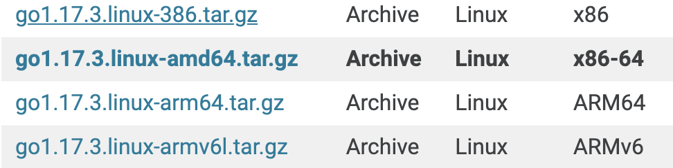

\# 寄存器
ax bx cx dx 通用寄存器

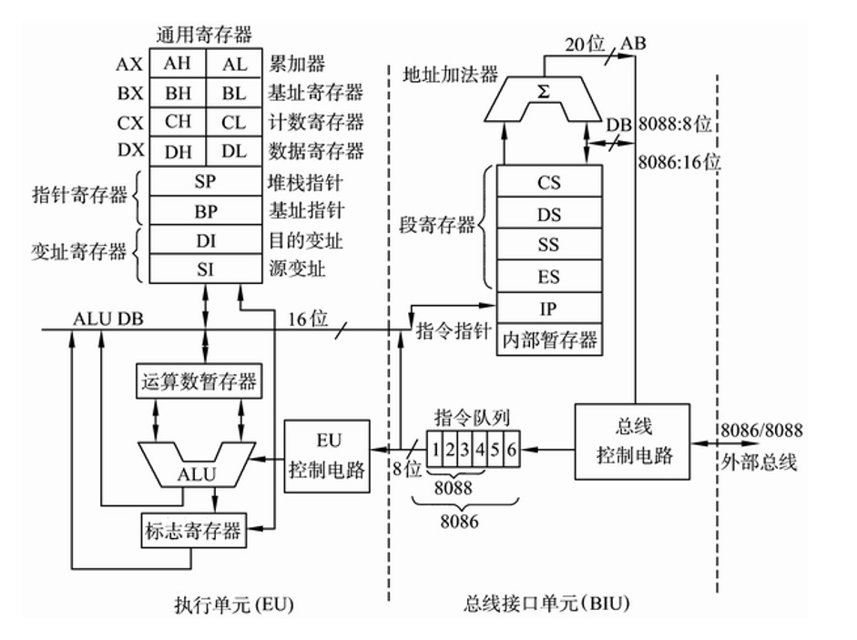

DS 段地址寄存器地址，可以通过[偏移地址]访问咯

DS寄存器不允许直接操作，需要通过通用寄存器设值，因为电路设计限制。

ES 附加段地址寄存器

​

​

SI DI 寄存器，[bx+si] [bx+di]

​

标志寄存器

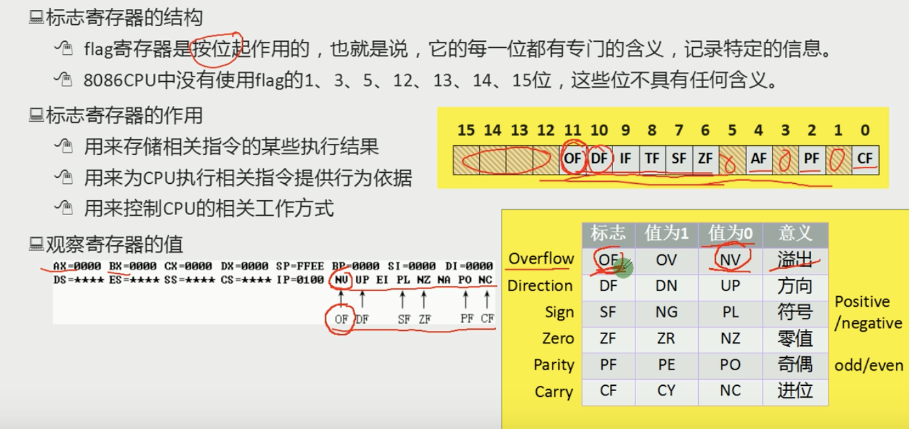

​

\# 指令

​

​

dup 重复

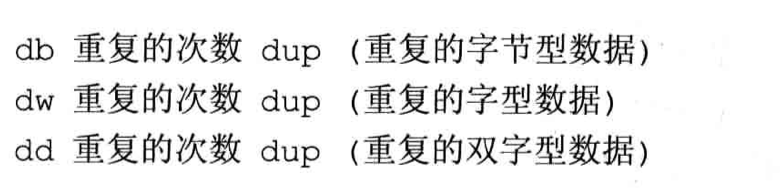

\## 运算指令
add 加法

inc bx；bx寄存器+1 b++ 与b=b+1的区别

div 除法 被除数默认放在AX或者 DX和AX 根据8位和16位决定取AX或者DX和AX

and 与

or 或

mul 乘法

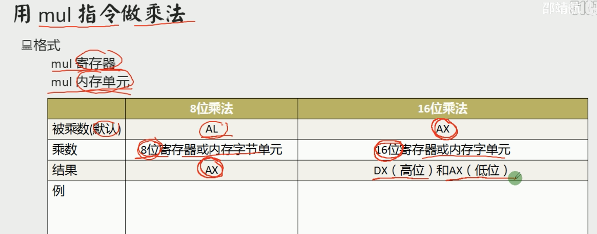

sbb 带借位减法指令

adc 带借位加法

​

\# 寄存器（内存访问）

\## 段的概念

\## 代码执行
cs:ip 存储的执行指令位置

​

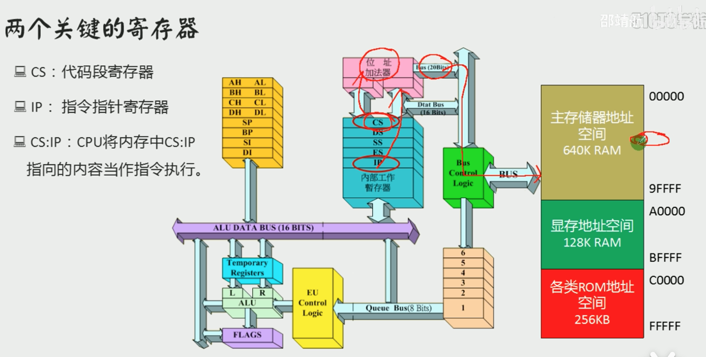

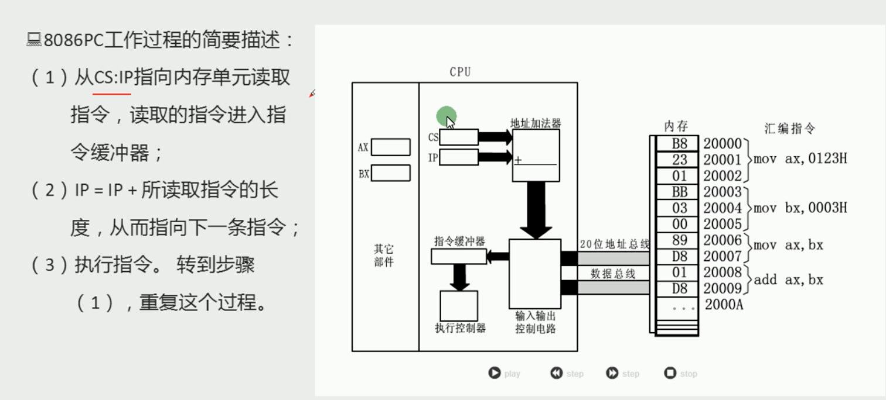

\## 栈
SS栈地址

SP 栈顶偏移地址

​

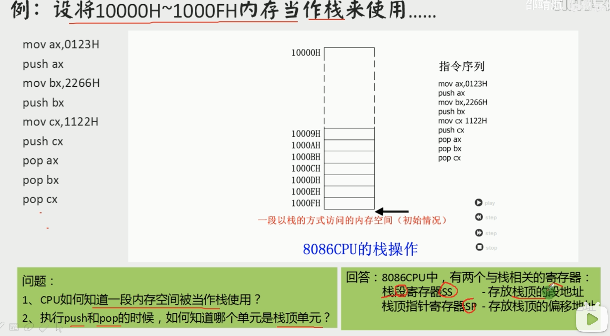

\# 语法
编译 链接

\## 段前缀
mov ax ,\*\*ds:\*\*[0] 用于显示的指明段地址

​

​

\## 在代码段中使用数据
dw define word 在代码段中定义数据

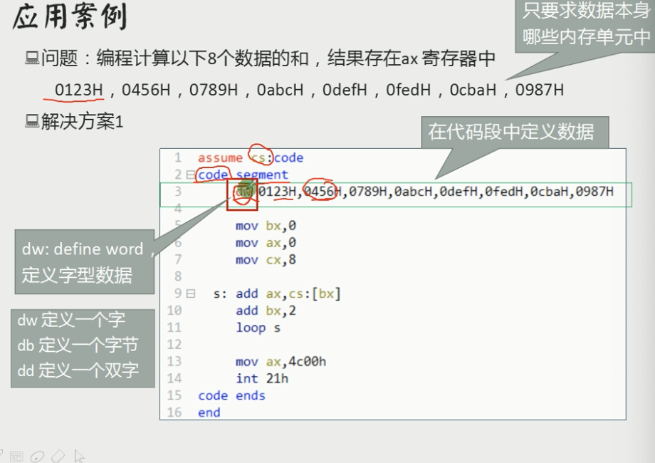

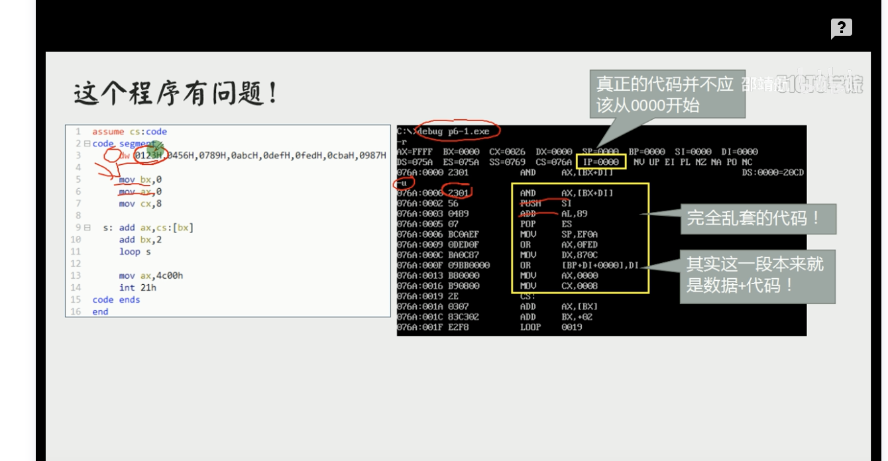

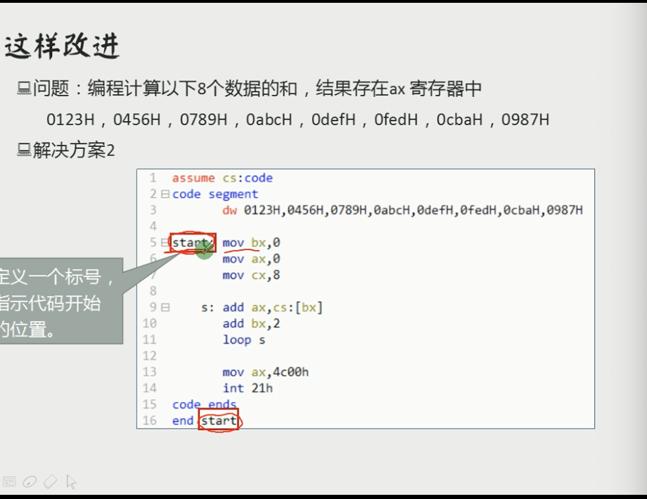

\## 数据、代码、栈 放入不同的段
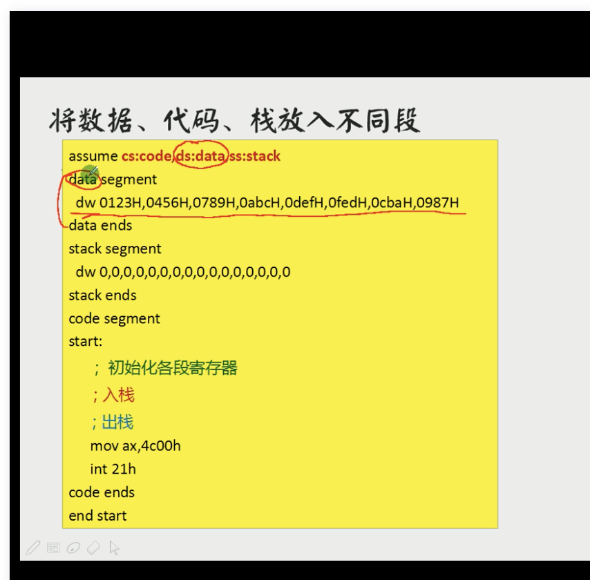

\# loop
cx 寄存器设置循环次数

​

loop和[bx] 结合

​

​

​

\# 内存寻址方式

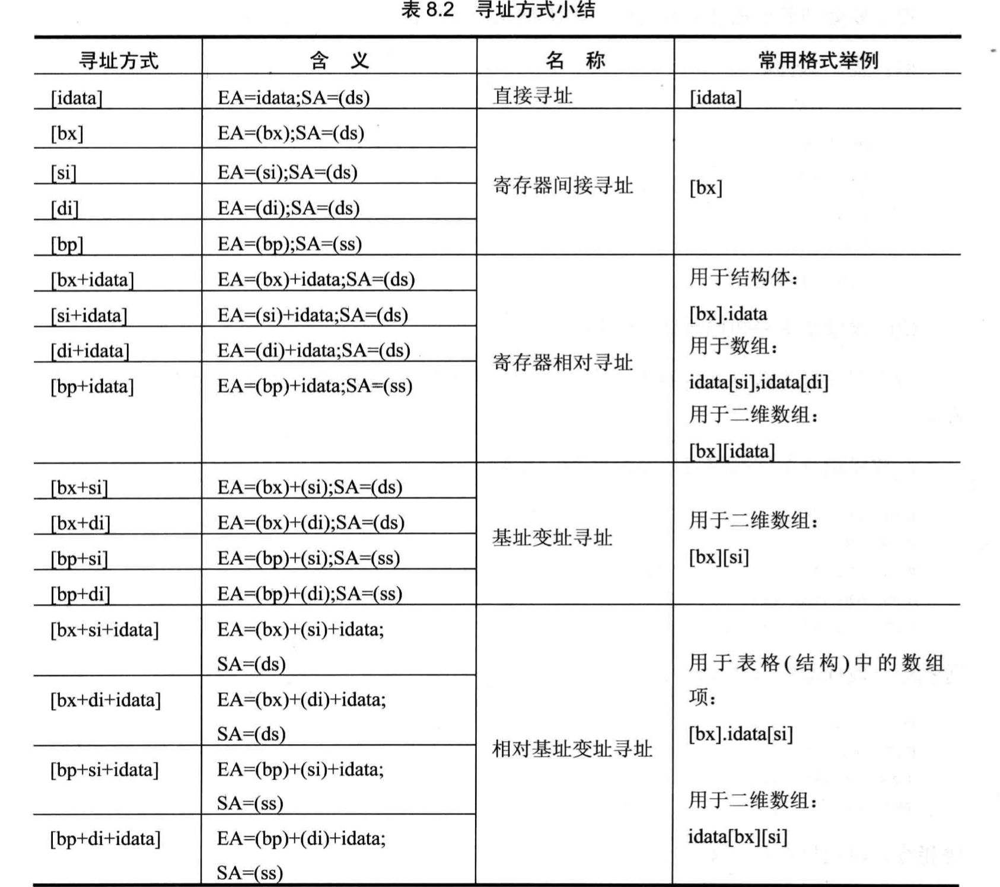

\# 转移
jmp

jcxz

call

ret

​

通过堆栈存储参数，解决寄存器冲突

子程序开始前 子程序使用的寄存器入栈，子程序结束后出栈