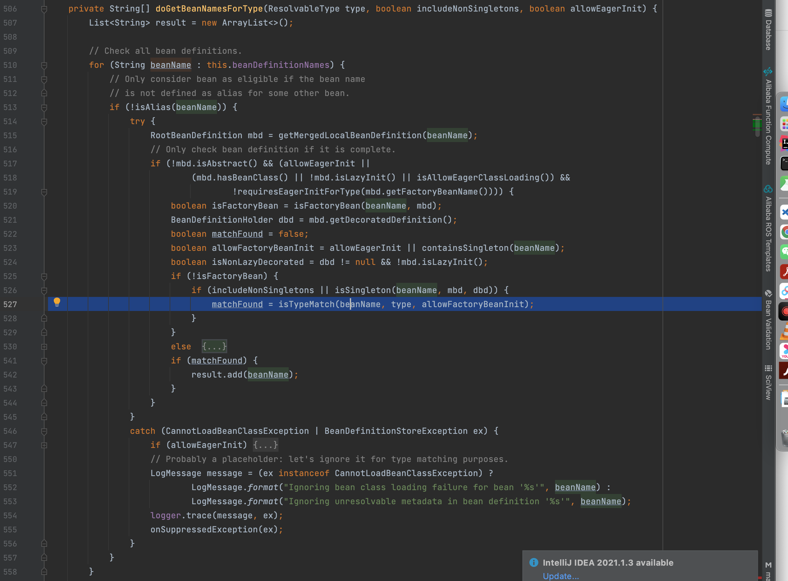

\# getBean过程
总述：bean的配置信息被描述成beandefinition对象 register到context中，通过beanDefinition能够创建bean对象，getBean的过程就是根据Class type转化称beanName通过bean-name找到对应的BeanDefinition从而构造bean

DefaultListableBeanFactory.getBean(Class type)

\|1->resolveBean(ResolvableType type)
\`\`\`
@Nullable
 private  T resolveBean(ResolvableType requiredType, @Nullable Object[] args, boolean nonUniqueAsNull) {
 //resolveNamedBean 获取Bean
 NamedBeanHolder namedBean = resolveNamedBean(requiredType, args, nonUniqueAsNull);
 if (namedBean != null) {
 return namedBean.getBeanInstance();
 }
 // 没取到从parent取
 BeanFactory parent = getParentBeanFactory();
 if (parent instanceof DefaultListableBeanFactory) {
 return ((DefaultListableBeanFactory) parent).resolveBean(requiredType, args, nonUniqueAsNull);
 }
 else if (parent != null) {
 ObjectProvider parentProvider = parent.getBeanProvider(requiredType);
 if (args != null) {
 return parentProvider.getObject(args);
 }
 else {
 return (nonUniqueAsNull ? parentProvider.getIfUnique() : parentProvider.getIfAvailable());
 }
 }
 return null;
 }
\`\`\`
\*\*\|2->\*\*resolveNamedBean

根据beanName取bean

 如果根据bean-type取到多个bean-name ,if else 逻辑注入 比如此时@Qualifier就起作用类

在转换成通过Bean-name获取Bean，将结果封装📦成NamedBeanHolder

\|3->getBeanNamesForType() 根据是否范型 走两个分支

getBeanNamesForType这里有一个cache存储了Class和已解析BeanName的结果

⚠️：Class类名相同类加载器ClassLoader不同不是同一个类（key)
\`\`\`
@Override
 public String[] getBeanNamesForType(@Nullable Class type, boolean includeNonSingletons, boolean allowEagerInit) {
 if (!isConfigurationFrozen() \|\| type == null \|\| !allowEagerInit) {
 return doGetBeanNamesForType(ResolvableType.forRawClass(type), includeNonSingletons, allowEagerInit);
 }
 Map, String[]> cache =
 (includeNonSingletons ? this.allBeanNamesByType : this.singletonBeanNamesByType);
 String[] resolvedBeanNames = cache.get(type);
 if (resolvedBeanNames != null) {
 return resolvedBeanNames;
 }
 resolvedBeanNames = doGetBeanNamesForType(ResolvableType.forRawClass(type), includeNonSingletons, true);
 if (ClassUtils.isCacheSafe(type, getBeanClassLoader())) {
 cache.put(type, resolvedBeanNames);
 }
 return resolvedBeanNames;
 }
\`\`\`
\|4->doGetBeanNamesForType()

循环所有的BeanNames跟type做匹配

通过Bean-Name获取Bean

\|-2->父类AbstractBeanFactory public  T getBean(String name, @Nullable Class requiredType, @Nullable Object... args)

\|-2->AbstractBeanFactory.doGetBean
\`\`\`
protected  T doGetBean(final String name, @Nullable final Class requiredType,
 @Nullable final Object[] args, boolean typeCheckOnly) throws BeansException {

 final String beanName = transformedBeanName(name);
 Object bean;

 // Eagerly check singleton cache for manually registered singletons.
 Object sharedInstance = getSingleton(beanName);
 if (sharedInstance != null && args == null) {
 if (logger.isTraceEnabled()) {
 if (isSingletonCurrentlyInCreation(beanName)) {
 logger.trace("Returning eagerly cached instance of singleton bean '" + beanName +
 "' that is not fully initialized yet - a consequence of a circular reference");
 }
 else {
 logger.trace("Returning cached instance of singleton bean '" + beanName + "'");
 }
 }
 bean = getObjectForBeanInstance(sharedInstance, name, beanName, null);
 }

 else {
 // Fail if we're already creating this bean instance:
 // We're assumably within a circular reference.
 if (isPrototypeCurrentlyInCreation(beanName)) {
 throw new BeanCurrentlyInCreationException(beanName);
 }

 // Check if bean definition exists in this factory.
 BeanFactory parentBeanFactory = getParentBeanFactory();
 if (parentBeanFactory != null && !containsBeanDefinition(beanName)) {
 // Not found -> check parent.
 String nameToLookup = originalBeanName(name);
 if (parentBeanFactory instanceof AbstractBeanFactory) {
 return ((AbstractBeanFactory) parentBeanFactory).doGetBean(
 nameToLookup, requiredType, args, typeCheckOnly);
 }
 else if (args != null) {
 // Delegation to parent with explicit args.
 return (T) parentBeanFactory.getBean(nameToLookup, args);
 }
 else if (requiredType != null) {
 // No args -> delegate to standard getBean method.
 return parentBeanFactory.getBean(nameToLookup, requiredType);
 }
 else {
 return (T) parentBeanFactory.getBean(nameToLookup);
 }
 }

 if (!typeCheckOnly) {
 markBeanAsCreated(beanName);
 }

 try {
 final RootBeanDefinition mbd = getMergedLocalBeanDefinition(beanName);
 checkMergedBeanDefinition(mbd, beanName, args);

 // Guarantee initialization of beans that the current bean depends on.
 String[] dependsOn = mbd.getDependsOn();
 if (dependsOn != null) {
 for (String dep : dependsOn) {
 if (isDependent(beanName, dep)) {
 throw new BeanCreationException(mbd.getResourceDescription(), beanName,
 "Circular depends-on relationship between '" + beanName + "' and '" + dep + "'");
 }
 registerDependentBean(dep, beanName);
 try {
 getBean(dep);
 }
 catch (NoSuchBeanDefinitionException ex) {
 throw new BeanCreationException(mbd.getResourceDescription(), beanName,
 "'" \+ beanName + "' depends on missing bean '" + dep + "'", ex);
 }
 }
 }

 // Create bean instance.
 if (mbd.isSingleton()) {
 sharedInstance = getSingleton(beanName, () -> {
 try {
 return createBean(beanName, mbd, args);
 }
 catch (BeansException ex) {
 // Explicitly remove instance from singleton cache: It might have been put there
 // eagerly by the creation process, to allow for circular reference resolution.
 // Also remove any beans that received a temporary reference to the bean.
 destroySingleton(beanName);
 throw ex;
 }
 });
 bean = getObjectForBeanInstance(sharedInstance, name, beanName, mbd);
 }

 else if (mbd.isPrototype()) {
 // It's a prototype -> create a new instance.
 Object prototypeInstance = null;
 try {
 beforePrototypeCreation(beanName);
 prototypeInstance = createBean(beanName, mbd, args);
 }
 finally {
 afterPrototypeCreation(beanName);
 }
 bean = getObjectForBeanInstance(prototypeInstance, name, beanName, mbd);
 }

 else {
 String scopeName = mbd.getScope();
 final Scope scope = this.scopes.get(scopeName);
 if (scope == null) {
 throw new IllegalStateException("No Scope registered for scope name '" + scopeName + "'");
 }
 try {
 Object scopedInstance = scope.get(beanName, () -> {
 beforePrototypeCreation(beanName);
 try {
 return createBean(beanName, mbd, args);
 }
 finally {
 afterPrototypeCreation(beanName);
 }
 });
 bean = getObjectForBeanInstance(scopedInstance, name, beanName, mbd);
 }
 catch (IllegalStateException ex) {
 throw new BeanCreationException(beanName,
 "Scope '" + scopeName + "' is not active for the current thread; consider " +
 "defining a scoped proxy for this bean if you intend to refer to it from a singleton",
 ex);
 }
 }
 }
 catch (BeansException ex) {
 cleanupAfterBeanCreationFailure(beanName);
 throw ex;
 }
 }

 // Check if required type matches the type of the actual bean instance.
 if (requiredType != null && !requiredType.isInstance(bean)) {
 try {
 T convertedBean = getTypeConverter().convertIfNecessary(bean, requiredType);
 if (convertedBean == null) {
 throw new BeanNotOfRequiredTypeException(name, requiredType, bean.getClass());
 }
 return convertedBean;
 }
 catch (TypeMismatchException ex) {
 if (logger.isTraceEnabled()) {
 logger.trace("Failed to convert bean '" + name + "' to required type '" +
 ClassUtils.getQualifiedName(requiredType) + "'", ex);
 }
 throw new BeanNotOfRequiredTypeException(name, requiredType, bean.getClass());
 }
 }
 return (T) bean;
 }
\`\`\`

解决循环依赖

DefaultSingletonBeanRegistry.java
\`\`\`

 /\\*\\*
 \\* Return the (raw) singleton object registered under the given name.
 \\*

Checks already instantiated singletons and also allows for an early
\\* reference to a currently created singleton (resolving a circular reference).
\\* @param beanName the name of the bean to look for
\\* @param allowEarlyReference whether early references should be created or not
\\* @return the registered singleton object, or {@code null} if none found
\*/
@Nullable
protected Object getSingleton(String beanName, boolean allowEarlyReference) {
Object singletonObject = this.singletonObjects.get(beanName);
if (singletonObject == null && isSingletonCurrentlyInCreation(beanName)) {
synchronized (this.singletonObjects) {
singletonObject = this.earlySingletonObjects.get(beanName);
if (singletonObject == null && allowEarlyReference) {
ObjectFactory singletonFactory = this.singletonFactories.get(beanName);
if (singletonFactory != null) {
singletonObject = singletonFactory.getObject();
this.earlySingletonObjects.put(beanName, singletonObject);
this.singletonFactories.remove(beanName);
}
}
}
}
return singletonObject;
}
\`\`\`