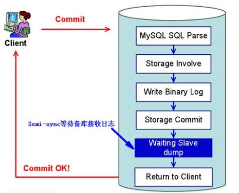
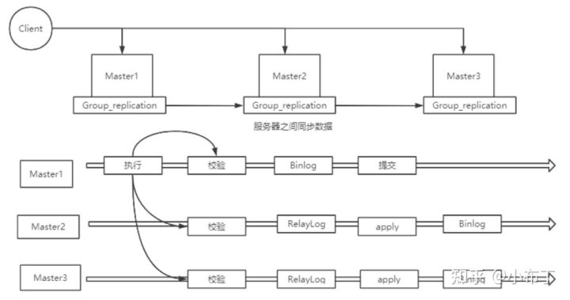
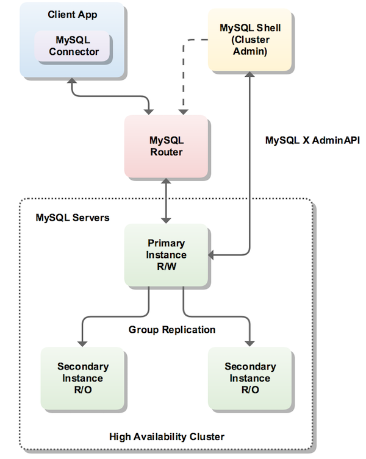

# 主从复制 replication
master .binlog -> slave 拉取binlog 放在relay log 执行

复制方式三种：

1 异步 **（Asynchronous replication） 默认**

2 全同步复制（Fully synchronous replication）

主库执行晚事务，所有从库也响应都执行完事务，返回给客户端

**3 半同步复制（Semisynchronous replication）**

** 5.7+**Loss-Less半同步复制 先等slave响应再提交

主库提交完事务等待至少一个从库成功写入relay log 就响应给客户端。

# 组复制 group replication
MGR(mysql group replication) Paxos协议

 核心解决异步复制和半同步复制数据一致性问题

 原理：若干节点组成复制组，一个事务发起提交，必须经过半数节点以上的决议通过，才可正常提交

缺点：仅支持Innodb，每个表必须有主键，GTID模式使用

# 集群 NDB cluster
ndb存储引擎

# HA
方案选型：

不要过左也不要过右

过右保守享受不到先进技术的红利

过左激进大概率有坑影响业务的迭代

中庸之道合适即可。官方支持更有生命力。

重点了解：**mysql InnoDB Cluster （mysql-operator@k8s)**

**

官方

可用性递增

replication -> group replication -> NDB cluster -> mysql InnoDB Cluster (@k8s([mysql-operator](https://github.com/oracle/mysql-operator))

### 其他
方式方法分类：监控节点(复制管理器）

MHA，MMA都属于此类 本质是一组脚本 最终通过转移VIP虚拟IP切换

共享存储，贵

[galera](https://galeracluster.com/)

 InnoDb 插件

[Percona XtraDB 集群](https://www.percona.com/software/mysql-database/percona-xtradb-cluster) 基于galera

[Orchestrator](https://github.com/openark/orchestrator) 重点在拓扑关系

[ProxySQL](https://proxysql.com/)

[phxsql](https://github.com/Tencent/phxsql) Tencent

### MGR（mysql group replication）

### Mysql InnoDB Cluster

### [MHA（master high availability )](https://github.com/yoshinorim/mha4mysql-manager) Facebook 日本人发明
非官方方法，借助manager node(三方脚本）类似 redis sentinel

### [MMM](https://mysql-mmm.org/) Multi-Master Replication Manager for MySQL 多主复制