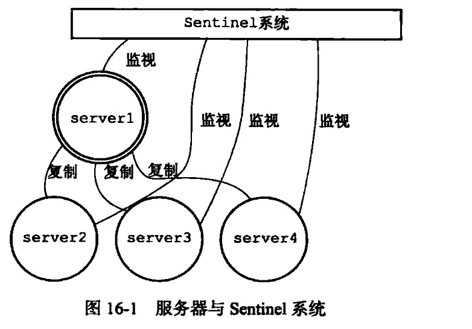
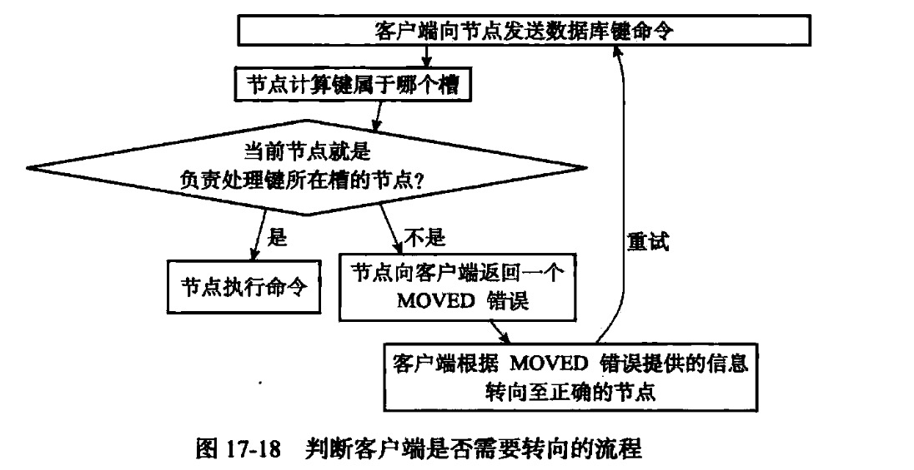

\# 复制(主从） replication
从服务器执行：slaveof masterIp 6379

主从复制过程：

从发送SYNC命令->主执行BGSAVE 生成RDB文件

RDB文件发送给从服务器->还原RDB

从服务器接受新的命令在本地执行。

命令传播阶段，从服务器以1s向主服务器发送命令

REPLCONF ACK

心跳偏移量

主服务器通过配置实现

min-slaves-to-write 3 // 服务器小于三个 拒绝写命令

min-slaves-max-lag 10 // 3个从库的心跳延迟超过10秒 拒绝写

\# sentinel
高可用方案

sentinel本是可以是多个

sentinel可以理解为是一个外部的客户端，具有监控、操作功能

sentinel连接master通过info获取slave信息

和所有slave+master连接

建立pub-sub

sentinel通过向主从服务器的\_sentinel\_:hello 频道发送消息向其他sentinel宣告自己的存在。

master服务器下线，sentinel集群需要选出一个master-sentinel进行操作

sentinel集群选举master-sentinel使用的是raft算法

master-sentinel再去选一个master-server

\# 集群 cluster

cluster主要解决水平扩容问题

sentinel主要解决的是主从可用性问题

 [sentine+ group ]

 [master master master] =cluster

[slave group][ slave group]

\*\*从服务设置readonly，向它才能读取\*\*

\## 节点
通过配置 cluster-enabled 开启

构建集群：

Cluster meet

维持其他节点数组

集群向其他节点发送Gossip消息

\## 槽指派

槽= 一致性hash 分组

每个Key都对应一个槽

CLUSTER ADDSLOTS [1-16384]

\## ack错误与Move错误

ack 转移过程中 槽节点变化

move 主从切换过程中