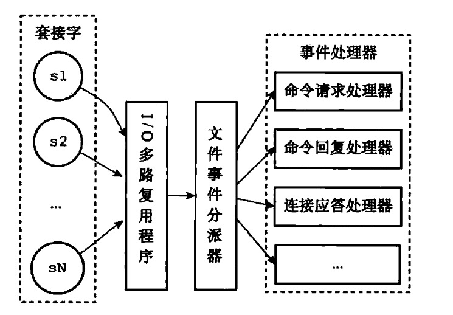

数据库select 有一个dict维护k-v 健是字符串，value是对应的数据结构

过期健保存在redisDb.字典中

过期策略

定时删除浪费CPU，惰性删除浪费内存

redis混合两种策略，expireIfNeeded过滤器，已过期就删除 + activeExpireCycle 从expire字典中取一部分检查并删除过期键

\# \*持久化
RDB = redis database

AOF =  append only file

\### RDB
ditry 计数器 lastsave属性

BGSAVE 命令 子进程保存 二进制压缩文件

自动保存间隔默认配置：
\`\`\`
save 900 1 //900秒有1个修改
save 300 10
save 60 10000
\`\`\`
默认100毫秒执行一次检查

启东时自动还原

\### AOF
持久化命令

命令写到缓存区，通过配置appendfsync控制写入时机 默认everysec每秒（与上次同步时间超过1秒，本地进行同步

AOF重写rewrite 制作snapshot快照

实现方式：不是通过分析日志，而是读取数据库现在的值

\*\*子进程\*\*执行aof\_rewrite,子进程带有服务器进程的数据副本，避免用锁

重写过程中将新命令写入重写缓冲区

\# 事件

\# 服务端

\# 客户端
java Redisson