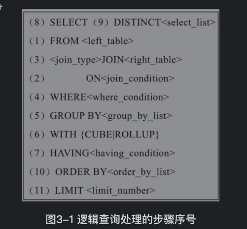

Char(N) Varchar(N)

N是字符长度

BINARY(N) VARBINARY(N) N指字节长度

# 逻辑查询处理


每个操作都会产生一张虚拟表，该虚拟表作为一个处理的输入。这些虚拟表对用户是透明的，只有最后一步生成的虚拟表才会返回给用户。

** Limit 5000,50 会把5w多条取出来再对虚拟表做截取

# 子查询
分类：标量子查询+多值子查询

Exists

只关注行的存在。

它允许数据库高效地检查指定查询是否产生某些行

In Exists在优化器足够稳定和优秀执行计划是一样的。

# 联接 join
On a=b 与 where a=b 一样的

> 从逻辑上讲，在哪里指定过滤条件都是一样的，通常不会有性能上的差异。唯一的准则就是可读性强。通过一种让DBA、开发人员感觉更自然的方式进行代码编写。例如，在表之间匹配记录的过滤器放在ON子句中，而只从一个表中过滤数据的条件放在WHERE子句中

## 联接算法
Simple Nested-Loops Join (NLJ)
```
//无索引
For each row r in R do
 For each row s in S do
 If r and s statisfy the join conditon
 Then output the tuple

// 有索引
For each row r in R do
 lookup r in S index
 if found s == r
 Then output the tuple

//优化器在一般情况下总是选择将联接列含有索引的表作为内部表
//两个表都有索引记录少的作为外表

```
Block Nested-Loops Join(BNL)

针对没有索引的表联接，每次读取10行记录

Batched Key Access Join

Classic Hash Join

实战：是关联查询字段还是分两次查询数据库？

答：可以通过explain查看执行计划，如果是内关联可以在数据库查，如果是外关联会产生全表扫描产生的笛卡尔积很大所以这种情况最好通过两次查