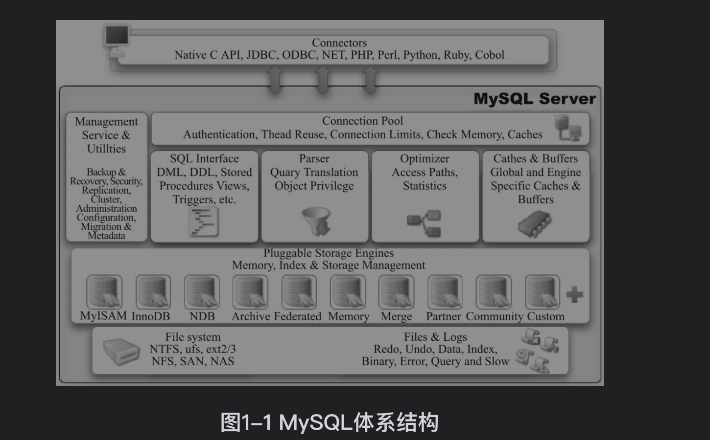
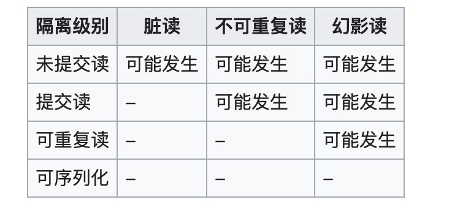

速记法

->

=>

<-

<=

表示层次关系

= 等 \- 连接 X.b X的b

x(sss) x的详细解释sss

@ at

\#

\# 主要问题

\# 学习路线
Sql编程->

体系结构->架构全景->

联接查询及算法-\> 执行计划 ->

索引->索引类型 B+树 ->

事务->MVCC 实现原理 日志，隔离级别->

锁->

表\- 文件管理，内存管理，线程->

\#

\# 体系结构

执行过程

\# 文件

\## 日志

\### 二进制日志
binary log 记录了对Mysql数据库执行更改的所有操作。

三种格式：

–基于SQL语句的复制(statement-based replication,SBR)，

–基于行的复制(row-based replication,RBR)，

–混合模式复制(mixed-based replication,MBR) ,能用statement用statement，

一般的语句修改使用statment格式保存binlog，如一些函数，statement无法完成主从复制的操作，则采用row格式保存binlog

控制参数：\`binlog\_format=\`

\# 表

\# 索引
InnoDb缓冲区（内存）大小通过 \`innodb\_buffer\_pool\_size\` 配置

LRU算法异步同步到磁盘

磁盘3ms 固态硬盘0.1ms

B+树演化过程

二叉树->平衡二叉树->B树->B+树
\> B+树是为磁盘或其他直接存取辅助设备设计的一种平衡查找树，在B+树中，所有记录节点都是按键值的大小顺序存放在同一层的叶子节点，各叶子节点通过指针进行链接

\## 为什么InnoDb using B+ tree?
1 CPU从磁盘读取数据到内存很慢,所以希望尽可能\*\*一次读取能查到更多的信息\*\*。

和B树比较，B 树可以在非叶结点中存储数据，但是 B+ 树的所有数据其实都存储在叶子节点中，所以存的节点多（如果内存很小没法缓存全部索引，存的就多，层级就少，磁盘扫描就少）

2 相较于B树\*\*范围查询算法复杂度要低\*\*

\*\*

\*\*

\### B+树索引的分裂

\## 聚集索引
聚集索引（主键索引）：叶子节点存放记录信息

MyISAM没有聚集索引， 辅助索引叶子节点存放的不是主键而是在数据文件（MYD）中的物理位置。

\## 辅助索引
辅助索引（二级索引 secondary Index）：叶子节点存放主键ID。

\## 联合索引
index(a,b)

where b=? 不能用到索引

联合索引的好处：在于对第二个键进行排序

\##

\## 哈希索引
自适应哈希索引，近数据库内部使用，满足一定条件数据库自己创建

\## 全文索引
倒排序索引，通过辅助表存储

select \* from fts\_a where match(body) against ('sub');

模式：

默认：in natural language mode

In boolean mode

With Query expansion

\##

\####

\## 利用索引查询优化技术

\### Multi-Range Read（MRR）
将数据随机访问转化成顺序访问

\### Index Condition Pushdown（ICP）
\> 当进行索引查询时，首先根据索引来查找记录，然后再根据WHERE条件来过滤记录
\> 即将WHERE的部分过滤操作放在了存储引擎层

使用ICP优化时执行计划Extra列有\`Using index condition\`提示

\### 覆盖索引
能从辅助索引中查询出来就不再使用聚集索引。

 执行计划看到Extra中Using index 使用了覆盖索引

\# 锁

\## 锁类型
S锁 共享锁

X锁 排他锁

\## 一致性非锁定读

\## 一致性锁定读
select \*\* from update 对读取的行加X锁，其他事物不能再加任何锁

select \*\* from lock in share mode 对读取的行加S锁，其他事物可以加S锁，但如果加X锁会被阻塞

\## 行锁三种算法

Record Lock 单行锁

Gap Lock 间隙锁 锁定一个范围，不包括记录本身

Next-Key Lock=Record Lock +Gap Lock .

采用不同层级的锁实现不同的隔离级别

\# [数据库事务](https://chi.jinzhao.wiki/wiki/%E6%95%B0%E6%8D%AE%E5%BA%93%E4%BA%8B%E5%8A%A1)

\## 特性ACID
原子性 atomicity、一致性 consistency 、隔离性 isolation、持久性 durability

\## 事务分类
扁平事务

带有保存点的扁平事务

链事务（Chained Transaction)

嵌套事务（Nested Transaction) InnoDB不支持

分布式事务（Distributed Transaction)

\## 隔离级别

可串行化 SERIALIZABLE

可重复度 REPEATABLE READS

控制锁的程度：没有范围锁，默认

总是读取事物开始时的行数据。

读提交 READ COMMITTED

总是读取行的最新版本。

未提交读READ UNCOMMITTED （最低级别）

\### 读现象
脏读

读到了另一个事务未提交的数据

不可重复读

一个事务中一行数据两次查询不一致

幻读

一个事务中相同的SQL不同的结果。

\## 实现原理
事务隔离性由锁控制实现，原子性，一致性，持久性通过redo log,undo log 实现。

事务<=lock +(redo+undo => mvcc)

\### 重做日志（redo log）
理解：事务成功->宕机->利用重做日志重做->保证持久性。

恢复提交事务修改的页操作，通常是物理日志，记录的是页的物理修改操作

实现事务的持久性。

通过参数 \`innodb\_flush\_log\_at\_trx\_commit\` 参数控制fsync执行情况。

1 每次事务提交写入日志文件调用fsync 默认值

0 事务提交不写入重做日志，master thread 1秒钟 fsync写入一次

2 提交时写入文件系统缓存（操作系统），不进行fsync

重做日志块512字节，和磁盘扇区大小一样，因此可以保证原子性

\### 回滚日志（undo log）
理解：用来回滚

回滚到行记录到某个特性版本，是逻辑日志，根据每行记录进行记录

INSERT语句生成DAELETE

DELETE生成INSERT

UPDATE生成相反的UPDATE

MVCC的实现是通过undo来完成的。

当用户读取一行记录时，如果该记录已经被其他事务占用，当前事务可以通过读取undo读取之前的行版本信息，以此实现非锁定读取。

undo log 也会产生redo log.

\### MVCC并发控制机制
MVCC使用时间戳 (TS), 或“自动增量的事务ID”实现“事务一致性”。MVCC可以确保每个事务(T)通常不必“读等待”数据库对象(P)。这通过对象有多个版本，每个版本有创建时间戳 与废止时间戳 (WTS)做到的。

事务Ti读取对象(P)时，\*\*只有比事务Ti的时间戳早\*\*，但是时间上最接近事务Ti的对象版本可见，且该版本应该没有被废止。

事务Ti写入对象P时，如果还有事务Tk要写入同一对象，则\*\*(Ti)必须早于(Tk)，即 (Ti) < (Tk)\*\*，才能成功。

MVCC可以无锁实现。

\*\*

\*\*

\#

\#

\#

\# 学习资料ref
使用：

[《高性能mysql》](https://www.jd.com/phb/key\_1713e9c53d337bf0c814.html)

《mysql high availability》高可用mysql

[ 官方文档](https://dev.mysql.com/doc/)

《mysql实战》李奇 极客时间 //入门引题

《Mysql技术内幕：SQL编程》\*\*姜承尧 \*\*

\*\*《MySQL技术内幕：InnoDB存储引擎》姜承尧 //深入\*\*

 search：blog

\#

\#