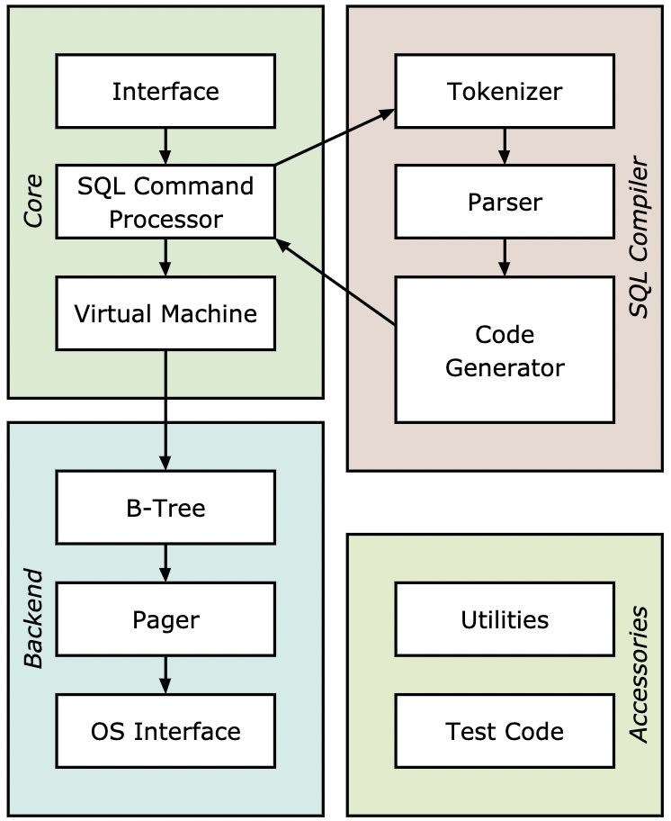
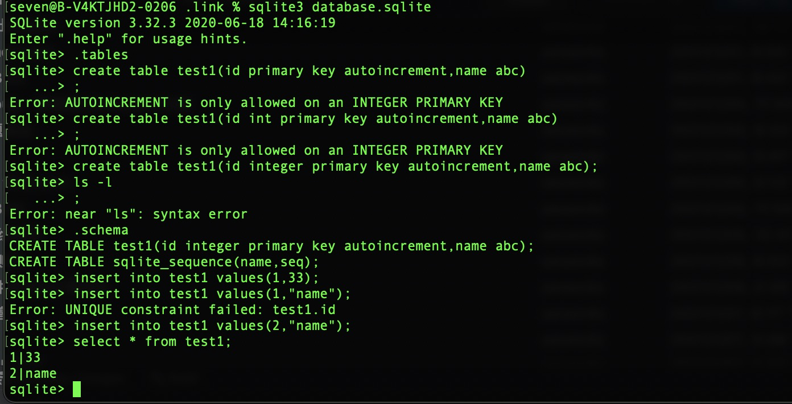

gui:[https://sqlitebrowser.org/](https://sqlitebrowser.org/)

\## 限制

最大 2^48 bytes

\## Shared-Cache Mode
减少 file 句柄

\## 锁和并发 3.0
[https://www.sqlite.org/lockingv3.html](https://www.sqlite.org/lockingv3.html)

\## 数据类型

[https://www.sqlite.org/datatype3.html](https://www.sqlite.org/datatype3.html)

没有日期类型

schema type free ,结构类型自由

xorm类型对应关系表：

[https://gobook.io/read/gitea.com/xorm/manual-zh-CN/chapter-02/4.columns.html](https://gobook.io/read/gitea.com/xorm/manual-zh-CN/chapter-02/4.columns.html)