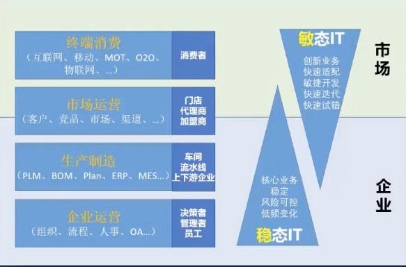

架构不存在

不存在某个实体叫架构，组件的拆封及组件的关系称之为架构

架构的实践还是研究的中间件，系统基础设施，把这些组件以某种模式、方法、原则组织起来的方式叫做架构，以及推及向上的人的组织关系

架构没法脱离业务而存在。

识别，抽象，分离，组合。

识别业务的动作，概念

抽象概念用计算机语言描述

分离解耦

学习路线

组件（中间件，消息队列，搜索引擎，缓存）

\*\*分布式系统基本原理\*\*

模式（微服务架构及治理）

前沿趋势（容器化，k8s, serveless ,service mesh ...

​

​

​

\# 架构分类
没有统一标准。

业务架构：业务域识别划分交互。

应用（服务）架构 ：关注：应用之间结构和交互

技术架构：可扩展，可服用，高可用，可伸缩 ，关注实现技术（软硬件）

数据架构

软件架构，系统架构，企业级架构，解决方案架构 ，XX架构

\## c4model
上下文（Context）、容器（Container）、组件（Component）和代码（Code）

\# DDD分层
\> code层的细分

表现层

应用层

领域层

基础设施层

持久层 manager层
\> 低耦合高内聚

业务->技术->团队

\# 企业架构

\# 常见非功能性需求
可用性，可伸缩，性能，可维护