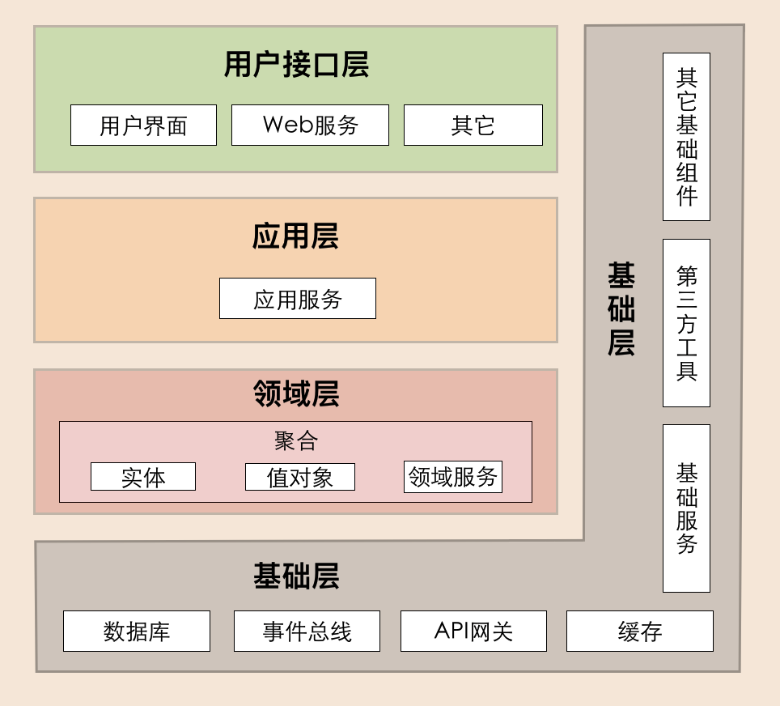
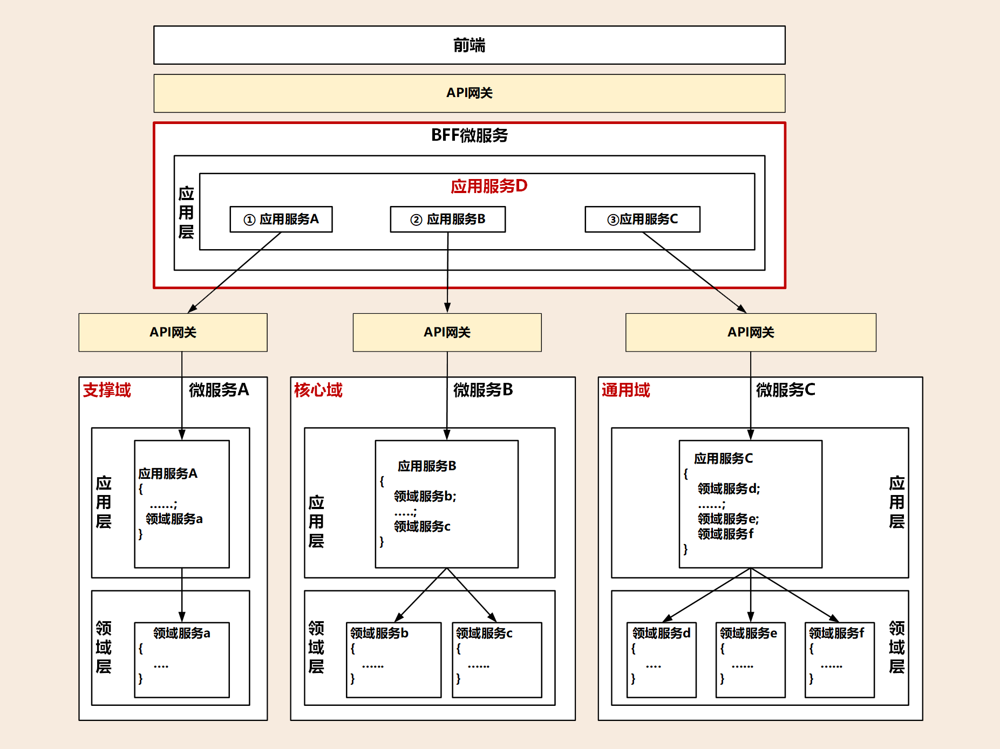
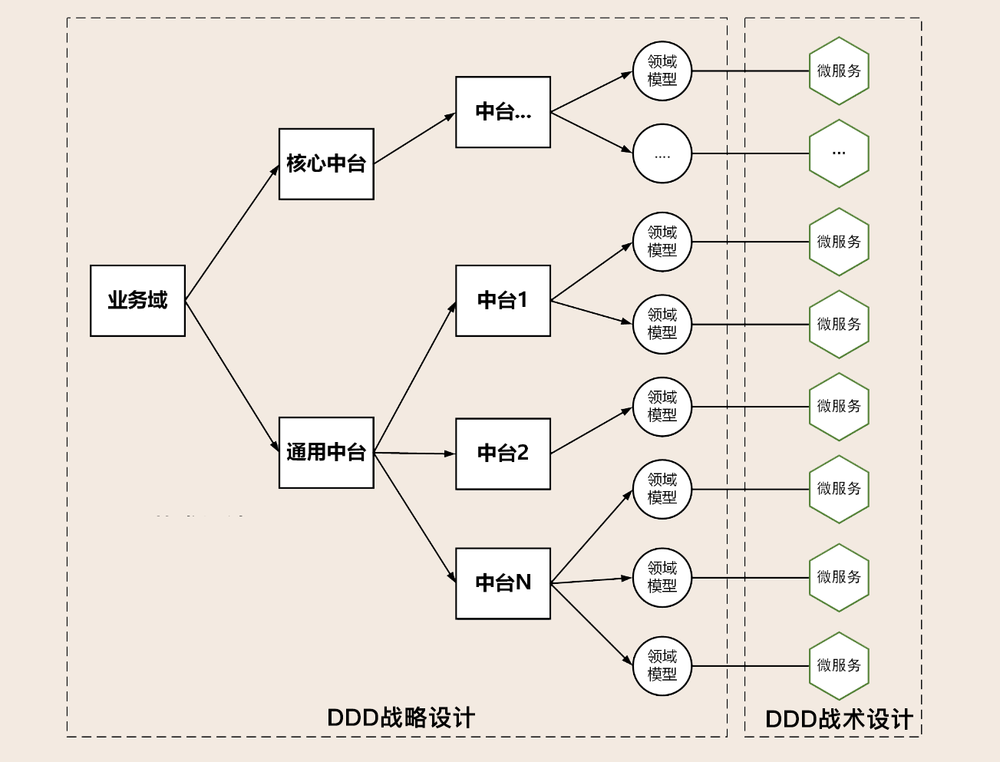

DDD is架构设计方法

微服务 is 架构风格

\# 领域
核心域、通用域和支撑域

不同公司不同业务核心域是不同的

战略设计，战术设计

\## 领域建模
战略设计

为了：

他们的：

这个：

是一个：

它可以：

而不像：

我们的产品：

战术设计

领域对象的整理：

层，领域模型，聚合，领域对象，领域类型，对应类，对应方法，对应包

\# bound context 上下文边界
通用语言内部沟通统一语言

领域边界 is bound context

\# 实体、值对象
实体 is 充血模型

实体 has id

实体use id to 追踪

值对象 is 属性集合 is vo

实体 can 嵌套 值对象 Person::Address

\# 聚合、聚合根
一类实体\- 聚合 \- 包

聚合根 is public 发言人

\# 领域事件
识别领域事件：：“如果发生……，则……”“当做完……的时候，请通知……”“发生……时，则……”

解耦

削峰填谷

最终一致

\# 分层
目标：解耦

不跨层调用

\# 架构模型

\## 整洁架构（ 洋葱架构）

\## 六边形架构（端口适配器架构）

\## DDD分层架构

\## 企业级中台微服务
Backend for Frontends

\# 中台
业务中台的建设可采用领域驱动设计方法，通过领域建模，将可复用的公共能力从各个单体剥离，沉淀并组合，采用微服务架构模式，建设成为可共享的通用能力中台。

\*\*数据中台的主要目标是打通数据孤岛，实现业务融合和创新。\*\*

\*\*

\# 代码模型

[https://github.com/ouchuangxin/leave-sample](https://github.com/ouchuangxin/leave-sample)

接口层有assembler负责DTO 和DO （领域对象）的互相转化

\# 其他相关

\## 前端
微前端架构