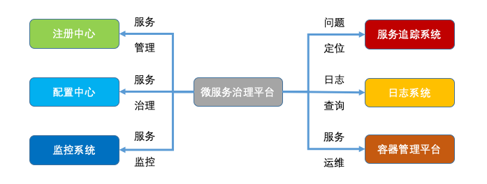

\# 问题域
服务描述：文档系统 apidoc,swagger

注册中心：nacos

服务框架：传输协议，压缩，序列化

服务监控

服务追踪，鹰眼

服务治理，降级 ，熔断，限流

熔断=保护

降级=目标与资源冲突，满足主要目标

限流 技术 sentiel, 限流算法，时间滑动窗口+令牌桶 ratelimiter

\# 注册中心
负载均衡算法 ，优先本机房，开发调试 本地优先

注册中心 like zookeeper

存储=目录树结构

监控检查=client service心跳 临时节点

服务状态变更=zookeeper watch 机制

\# 服务调用
通信 http tpc/ip socket

服务端处理 ，BIO NIO （多路复用，select，poll,epoll), AIO netty,tio

node libuv =nio

\## 服务路由
vs 负载均衡算法

排除（脏）节点

灰度

黑白名单

机房隔离

读写分离

配置（节点属性）from：本地，配置中心，脚本2

\## 序列化
序列化 (性能，压缩比）：json,Hessian,avro,kryo, jdk ObjectSerialize，FST

序列化和字节序

​

\# 监控
prometheus+grafana

CAT美团

接口监控，资源监控，基础监控

监控指标

\# 链路追踪
祖师：Google dapper

全局唯一ID +日志 + 展示平台

阿里 鹰眼 EagleEye

开源 SkyWalking

​

\# 服务治理

\## 节点管理
生产者心跳机制 无心跳摘除

消费者调用失败摘除 之后探活 = 静态注册中心

\## 负载均衡
加权轮询算法 1-2=node0,3~7=node1

最少活跃算法，维护表

一致性哈希 避免节点数量变化引起请求剧烈变动

\## 限流

\## 降级
实现方式：开关系统

系统内存中有开关，端口侦探修改内存状态

\## 熔断
a->b = error

a -X->b

调用下层系统出错，停止调用，稍后探测

\## 服务容错

需要考虑幂等

FailOver 失败自动切换，换另外节点调用

FailBack 失败通知，查询是否生效，生效不重试，未生效重试

FailCache 稍后重试

FailFast 快速失败

​

​

\# 网关
spring-cloud-zuul

spring-cloud-gateway

\# 配置中心
nacos

apollo

\# 开源框架
dubbo

tars c++ 腾讯

Spring-cloud

grpc http2 IDL=ProtoBuf

Thrift facebook

多语言支持 Sidecar模式 dubbo=dubbo mesh

\# 微服务治理平台

octo 美团

\#

\# 相关领域

\## 容器
基础环境 操作系统

运行时 java nodejs

web容器

业务代码 app

register高可用

\### 容器调度
docker 两种调度策略spread（平均机器）和binpack（集中机器）

服务发现，1 nginx +consul relaod 2 注册中心

\## devops

\## 容器规划系统
容量来自压测

压测选好指标：资源cpu,内存使用率？平均响应耗时？错误率？慢速比？

容量 =水位线 >level 着级扩容
\## 多地多机房多活
wmb 复制

多地 南方北方 少延迟\+ 可用性+

多机房 容灾+

实时性高的场景比如交易肯定还是有个master做强事物控制？

？这里是个严肃的问题，研究一下支付宝架构

\## vs Service Mesh
Istio

sidecar + local socket

DDD领域模型 给微服务划分提供参考

容器化部署+持续集成+自动化 是微服务落地土壤

devops