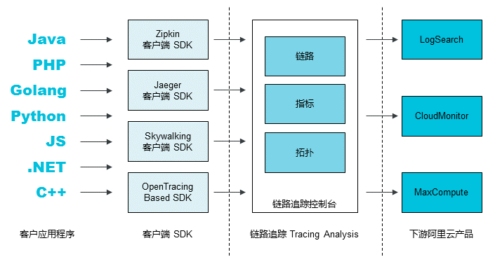
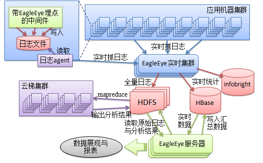
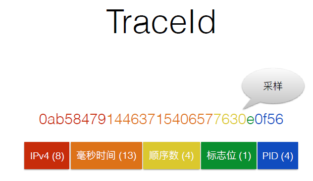
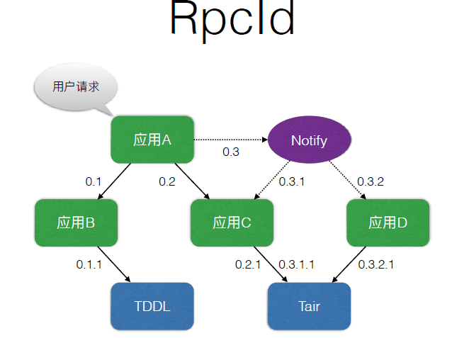
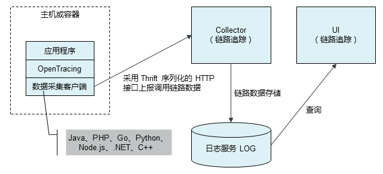
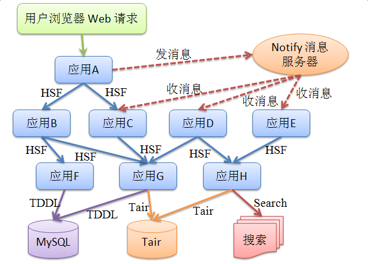

DST = Distributed link tracking

\# 概念术语
开源平台：zipkin,jaeger,skywalking,openTracing

云产品：[https://help.aliyun.com/document\_detail/91317.html?spm=a2c4g.11186623.6.542.48d22f7dSLQb9y](https://help.aliyun.com/document\_detail/91317.html?spm=a2c4g.11186623.6.542.48d22f7dSLQb9y)

架构设计图：

TraceId

一个调用链唯一标识

RpcId

区分层次，先后顺序

\*\*

\*\*Span\*\*（跨度）一次打点，span构成链路

\*\*数据透传\*\*

解参绑定context

数据上报过程：

\# 应用场景

链路追踪

容量规划，分析间接依赖，协助以全局视角规划容量

依赖梳理，强依赖：调用失败中断主流程，高度依赖，调用链路命中某个依赖几率高，频繁依赖，一次链路调用依赖次数多

异步场景处理。

EagleEye基于ThreadLocal实现上下文的存储，对于异步调用，需要数据透传，手动传递context
\`\`\`
Object ctx = EagleEye.getRpcContext(); // 从当前 ThreadLocal 备份
MyAsyncTask task = new MyAsyncTask(); // 这里的 MyAsyncTask 是一个业务自定义的 Runnable，保存ctx对象
task.setRpcContext(ctx); // 将 ctx 保存到 task 中
Future future = bizThreadPoolExecutor.submit(task); // 提交任务
// 后面继续执行其他逻辑，或者用 future.get() 等待任务的结果，都没有问题
// 如果 submit 多个 task，每个 task 都需要保存一份 ctx
\`\`\`

\# 日志格式
入口型：

traceId\|timestamp\|rpcType\|span\|rpcId\|resultCode\|traceName\|extInfo\|userData

客户端型：

traceId\|timestamp\|rpcType\|rpcId\|serviceName\|method\|remoteIp\|span\|resultCode\|requestSize\|responseSize\|extInfo\|userData

服务端类型： traceId\|timestamp\|rpcType\|rpcId\|serviceName\|method\|resultCode\|remoteIp\|span\|responseSize\|extInfo\|userData

$非JAVA应用接入时需按照EagleEye的日志规范打印日志，EagleEye会自动收集并展现报表和调用链，但是需要完成

\# 产品对比
DST = Distributed link tracking

内部：eagleeye \*\*Tracer \*\*

\*\*

xtrace [https://www.aliyun.com/product/xtrace](https://www.aliyun.com/product/xtrace)

arms [https://www.aliyun.com/product/arms](https://www.aliyun.com/product/arms)

\| 产品 \| 蚂蚁 \| 集团 \|
\| \-\-\- \| \-\-\- \| \-\-\- \|
\| SOA框架 \| [SOFA](https://lark.alipay.com/middleware/sofa4) \| [HSF](http://gitlab.alibaba-inc.com/middleware/hsf2-0/wikis/home) \|
\| 容器 \| [CE](https://lark.alipay.com/middleware/cloudengine) \| alitomcat \|
\| 消息中间件（推） \| [MsgBroker](https://lark.alipay.com/middleware/msgbroker) \| notify \|
\| 消息中间件（拉） \| [AntQ](https://lark.alipay.com/middleware/antq) \| metaq \|
\| 数据库中间件 \| [ZDAL](https://lark.alipay.com/middleware/zdal) \| TDDL \|
\| 全链路追踪 \| [Tracer](https://lark.alipay.com/middleware/tracer) \| [eagleeye](http://eagleeye.alibaba-inc.com/) \|
\| 定时任务 \| [Scheduler](https://lark.alipay.com/middleware/scheduler) \| [SchedulerX](http://gitlab.alibaba-inc.com/middleware-dts/dts-wiki/wikis/home) \|
\| 分布式配置 \| [DRM](https://lark.alipay.com/middleware/drm) \| [diamond](http://gitlab.alibaba-inc.com/middleware/diamond/wikis/home) \|
\| 缓存 \| [ZCache](https://lark.alipay.com/middleware/zcache)(tair) \| tair \|
\| 分布式事物 \| [XTS](https://lark.alipay.com/middleware/xts) \| TXC \|
\| 持续交付平台 \| [aone](https://aone.alipay.com/) \| [aone](https://aone.alibaba-inc.com/) \|
\| 找资料 \| [蚂蚁工程师之家](http://atit.alipay.net/index.php) \| ata \|
\| 运维平台 \| [九州](https://jiuzhou.alipay.com/workbench/main.htm)、[AQC](http://paas.aqc.alipay.net/paas/publicServer.htm) \| psp \|
\| 数据库管理 \| [IDB](http://idb4.alipay.com/) \| [IDB](http://idb4.alibaba-inc.com/) \|
\| 云端离线数据 \| [d2](http://d2.alibaba-inc.com/) \| [d2](http://d2.alibaba-inc.com/) \|
\| 环境配置管理 \| [antx](http://atit.alipay.net/index.php?r=blog/detail&qid=2837) \| aone配置项 \|
\| 限流 \| [SLA](https://lark.alipay.com/middleware/sla/gqdub6) \| SENTINEL \|
\| 前端并发调用 \| [chair](http://chair.alibaba-inc.com/zh-cn/chair/rpc.html) \| \|

\# 集成阿里云产品