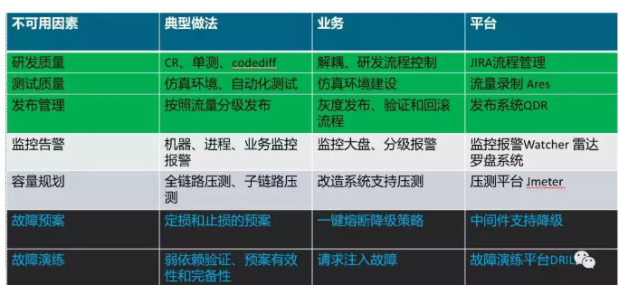
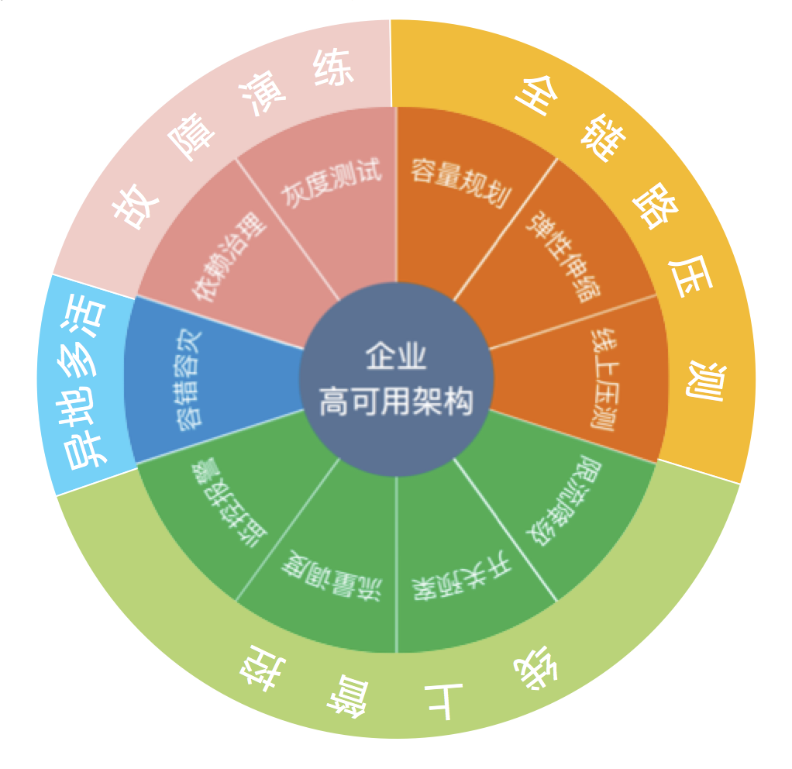

\# 纬度 视角
按照层，接入层，服务层，基础设施层

按照目标，容灾，容错，容量

按照领域，架构设计， 编码实施，组织建设

按照场景，负载均衡，网管，应用服务，缓存，数据库，消息，配置，存储

\#

\# 应用实施层 p1

\## 超时保护
快速失败failfast

\## 限流

限流算法：

\*\*令牌桶算法（Token Bucket）\*\* \*\*漏桶算法（Leaky Bucket），滑动窗口算法\*\*

\*\*

\## 熔断
基于线程池，基于信号量

\## 降级

\## 重试

\## 功能开关

\## VIP
tcp/ip ARP协议

IP地址是个逻辑地址，真实的数据传输depend物理地址MAC地址。

ARP缓存存储了一个网络内都IP地址和MAC地址对应关系。以太网的主机发送数据从缓存中取目标IP对应的MAC地址
\`\`\`
(192.168.1.219) at 00:21:5A:DB:68:E8 [ether] on bond0
(192.168.1.217) at 00:21:5A:DB:68:E8 [ether] on bond0
(192.168.1.218) at 00:21:5A:DB:7F:C2 [ether] on bond0
// 217 218 为真实电脑 217主，218备
// 217宕机后
(192.168.1.219) at 00:21:5A:DB:7F:C2 [ether] on bond0
(192.168.1.217) at 00:21:5A:DB:68:E8 [ether] on bond0
(192.168.1.218) at 00:21:5A:DB:7F:C2 [ether] on bond0

\`\`\`

\# 宏观架构层 p2

\## 异地多活
Multi-Active Availability

\## 集群
副本

一致性hash

分区

\## 负载均衡
 无状态

LVM

\## 自动伸缩
容量

\## 故障转移
failover

\## 安全
防爬

流量清晰

\## 高可用设计原则

\|  原则 \| 能力 \|
\| \-\-\- \| \-\-\- \|
\| 冗余 \| 服务冗余 \|
\| \| 数据冗余 \|
\| 自愈 \| 请求重试 \|
\| \| 数据恢复 \|
\| 隔离 \| 集群隔离 \|
\| \| 线程隔离 \|
\| \| 读写隔离 \|
\| \| 资源隔离 \|
\| 降级 \| 依赖降级 \|
\| \| 熔断降级 \|

\#

\# 组织战略层 p3

\## 混沌工程

\### 模拟故障方法
CPU满载：利用openssl计算密钥

写磁盘：利用dd命令对块设备填充

读磁盘：利用dd命令

网络延迟：利用tc命令在qdisc队列进行延迟设置

网络屏蔽：通过iptables设置屏蔽，或者通过tc命令在qdisc队列设置

网络丢包：通过tc买两块在qdisk队列进行丢包设置

DNS异常：通过修改HOSTS文件进行DNS劫持

进程故障：kill -9 pid

应用服务故障：通过Java Instrument Agent实现技术故障诸如，例如 mysql延迟或异常，消息消费，

容器故障：docker kill ,kill -9 daemon

物理机：shutdown -rn now,重启 reboot

\## 强弱依赖治理

[https://my.oschina.net/u/2822116/blog/915979](https://my.oschina.net/u/2822116/blog/915979)

国内酒店稳定性治理实践之系统间依赖治理

[https://www.infoq.cn/article/65gXxILNmjHvoqjwRcSk](https://www.infoq.cn/article/65gXxILNmjHvoqjwRcSk)

\## 全链路压测

\## 变更管理（发布系统）
代码检查，安全检测

\### 可灰度

\###

\### 可回滚

\## 统一监控
暴露问题

\## Logging infrastructure

\# 云上高可用产品 p4

