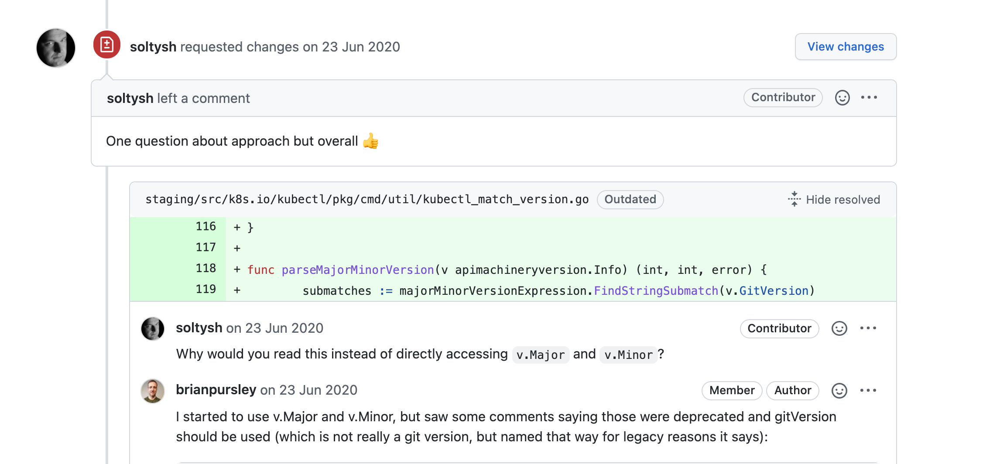
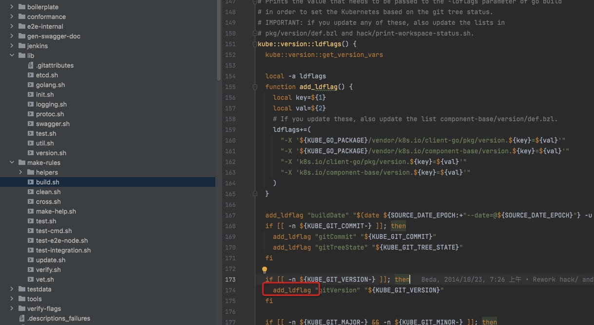

\# 基本概念
[sig](https://github.com/kubernetes/community/blob/master/sig-list.md)

​

working group 临时工作组 sig的组合。

​

User Groups

​

Committees

​

KEP(Kubernetes Enhancement Proposals )

 kubernetes/Enhancements

提案类似Java jsr

​

\## 代码关系
go.mod replace 源码到 staging

​

kubernetes/kubernetes 主要的仓库

kubernetes/kubectl 用来追踪issue

kubernetes-sigs/ 相关的工作

[https://github.com/kubernetes-csi](https://github.com/kubernetes-csi)

​

\# PR过程

OWNERS 文件定义review人和审批人 由prow使用

[code review 流程](https://github.com/kubernetes/community/blob/master/contributors/guide/owners.md)

​

​

​

​

​

​

\# 例子
问题

[https://github.com/kubernetes/kubectl/issues/675](https://github.com/kubernetes/kubectl/issues/675)

引到 [https://github.com/kubernetes/kubectl/issues/709](https://github.com/kubernetes/kubectl/issues/709) 讨论

​

需求

[https://github.com/kubernetes/kubectl/issues/685](https://github.com/kubernetes/kubectl/issues/685)

​

第一次提交 review 方案有问题

[https://github.com/kubernetes/kubernetes/pull/92152](https://github.com/kubernetes/kubernetes/pull/92152)

第二次提交

​

[https://github.com/kubernetes/kubernetes/pull/98250](https://github.com/kubernetes/kubernetes/pull/98250)

​

​

\## 知识点
通过LD 链接 设置的staging/src/k8s.io/apimachinery/pkg/version/types.go

​

​

chatops

 机器人

​