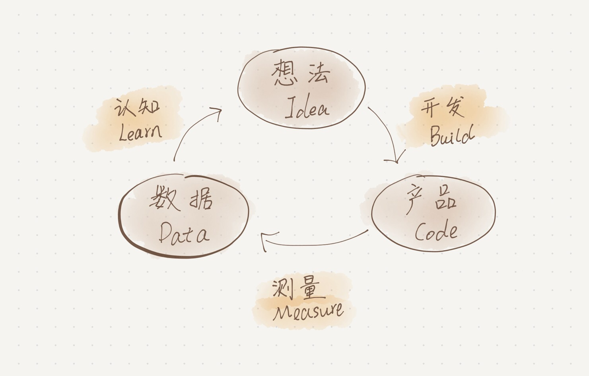
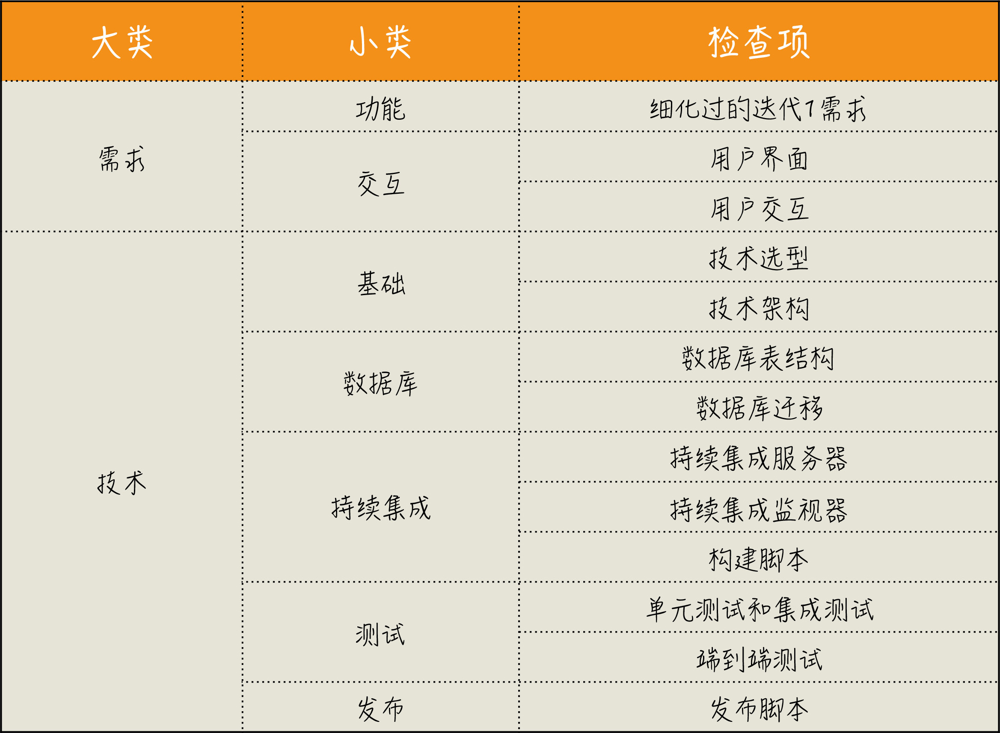
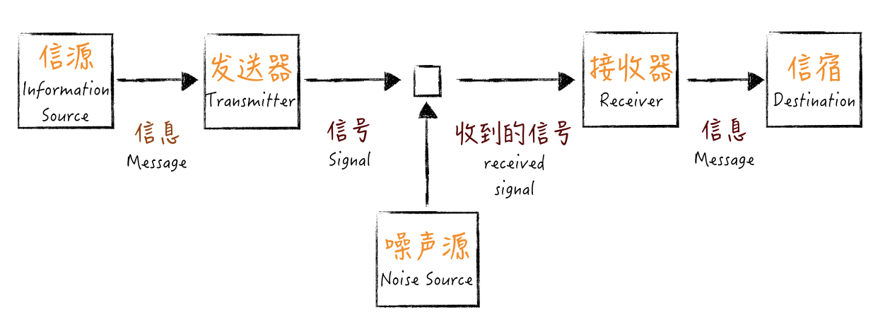
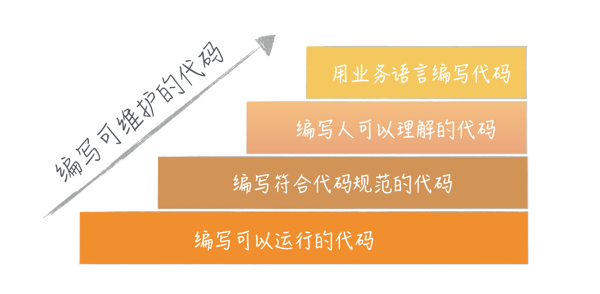
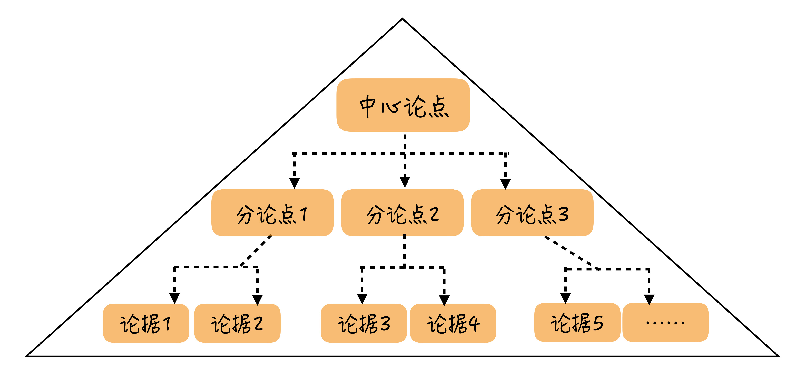

\*\*本质复杂度（Essential Complexity）和偶然复杂度（Accident Complexity）。\*\*

原则：

\- 以终为始；
\- 任务分解；
\- 沟通反馈；
\- 自动化。

\# 思考框架

\- 我现在是个什么水平？
\- 我想达到一个什么水平？
\- 我将怎样到达那个目标？

 =

\- Where are we?（我们现在在哪？）
\- Where are we going?（我们要到哪儿去？）
\- How can we get there?（我们如何到达那里？）

=

\- 现状；
\- 目标；
\- 实现路径。

\# 以终为始
逆向思维，结果反推

终=交付价值=可运行的软件

通过设置检查点清单定义任务完成✅

用户故事=As a （Role）, I want to （Activity）, so that （Business Value）.

+

正反测试用例

～=

需求描述，需求边界

解决集成难：

每日构建-自动化，pipeline->持续集成->持续交付

精益创业思想：

MVP（Minimum Viable Product）：最小代价可行产品

“越俎代庖”

产品思维

设计方法

测试

商业老板

全周期沙盘推演：设计

监控：数字-》理性

迭代0项目准备：

\# 任务分解

分解到-可执行

深度了解才能看到细节

feature->use story->task

多写单元测试，不写单元测试原因有可能是知识欠缺，不会写单元测试

TDD must refactor

编写可测试的代码

代码评审推向极限=结对编程

极限编程：什么东西好推向极限

任务拆分越细越好

1\. 让自己的工作可以被量化。

2\. 可以加强对任务估算的能力。

3\. 可以掌控项目的进度。

4\. 减少被打断的，上下文切换

数据访问层：

J2EE DAO

mybatis mapper

DDD repository

单元测试=\*\*前置准备、执行、断言和清理\*\*

单元测试评判标准：

\- Automatic，自动化；
\- Thorough，全面的；
\- Repeatable，可重复的；
\- Independent，独立的；
\- Professional，专业的。

需求评估原则：

Independent，独立的

Negotiable，可协商的

Valuable，有价值的

Estimatable，可估算的

Small，小

Testable，可测试的

需求只做重要的时

\# 沟通反馈

香农信息论

高手的话听不懂是自己解码能力不行

应该再加一个检查，复述

每日站会：

\*\*“做了什么” \*\*，是为了与其他人同步进展，看事情是否在计划上。一旦偏离计划，请主动把它提出，这样，项目经理可以过问，因为这会涉及到是否要调整项目计划；

\*\*“要做什么” \*\*，是同步你接下来的工作安排。如果涉及到与其他人协作，也就是告诉大家，让他们有个配合的心理准备；

\*\*“问题和求助”\*\*， 就是与其他人的协作，表示：我遇到不懂的问题，你们有信息的话，可以给我提供一下。

少开会多面对面沟通

工作可视化，看板

技术雷达自己制作：[https://github.com/thoughtworks/build-your-own-radar](https://github.com/thoughtworks/build-your-own-radar)

复盘 ：

圣斗士不会被同样的招数击败两次。

5个为什么，问到底

搞不定的问题尽早向上反馈。fail fast，尽早暴露问题

结构化文档

金字塔思维：

重构 to 模式

重构 to cleanCode

\# 自动化

[Behaviour-Driven Development](http://en.wikipedia.org/wiki/Behavior\_driven\_development) (BDD)

\- 单一职责原则（Single responsibility principle，SRP）
\- 开放封闭原则（Open–closed principle，OCP）
\- Liskov 替换原则（Liskov substitution principle，LSP）
\- 接口隔离原则（Interface segregation principle，ISP）
\- 依赖倒置原则（Dependency inversion principle，DIP）

不要为设计模式而设计模式。

架构原则：

适用优于业内领先，演变好过贪大求全，简单优于复杂。

这一篇有点水，扯来其他的领域：devops，DDD。

\# 总结
科普项目管理最佳事件

推TDD DDD ，重新换起来对TDD的兴趣重试程度

扯devops的话题

都是我已经直到但没串起来但最佳实践经验，本专栏帮我串起来。