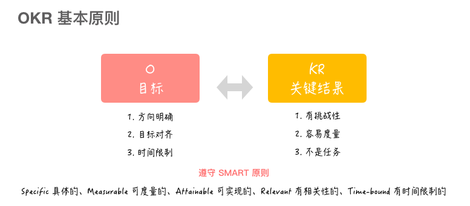
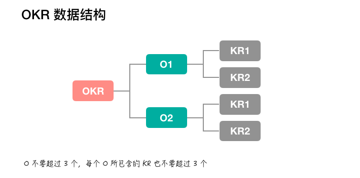
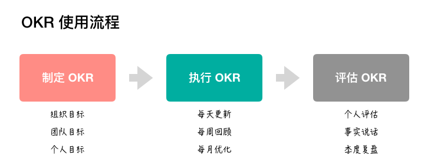
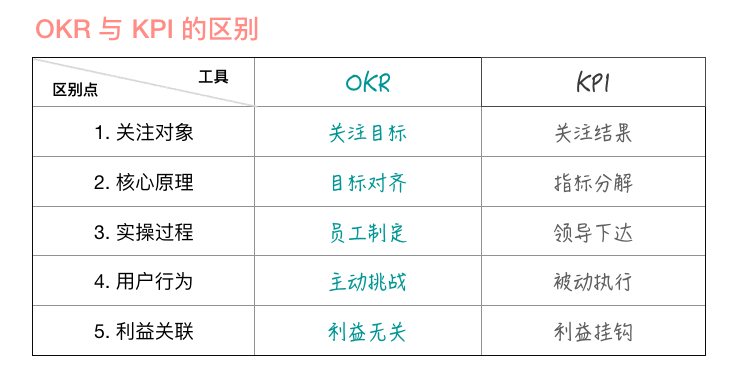
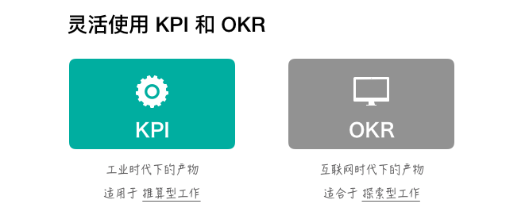
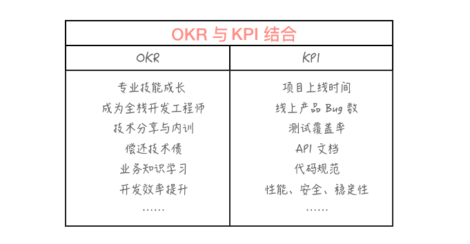
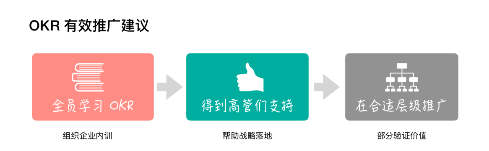
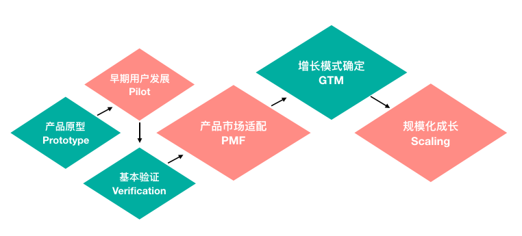
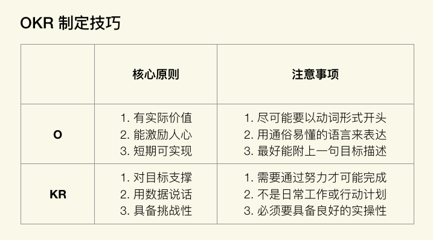

\# 

\#

\# ●  入门
●  OKR- overview

●  OKR基本原则

●  OKR数据结果

●  OKR使用流程

●  产品适用，外包不适用

●  它必须是一个产品型公司的技术团队，才能从 OKR 工作法中获益。而外包开发型团队的目标管理直接受制于客户合同，基本上可以概括为交付目标，它理想的管理手段就是瀑布式项目管理，而基本不需要 OKR 方法

●  OKR vs KPI

●  OKR 的核心原理在于“目标对齐”，而 KPI 的核心原理却在于“指标分解”。

●  适用场景，工厂适合KPI 知识型劳动适合OKR

●  在企业中实施OKR

●  适合的土壤（内驱力较强的团队，了解OKR，高管支持），小范围适用

●  先影响身边的人

●  循序渐进

●  OKR实施先决条件

●  公开透明的沟通，信守承诺的交付，勇于挑战压力

●  团队文化是落地 OKR 的土壤，内驱力是实践 OKR 的根基。

●  团队内驱力很强，适合使用 OKR，反之，更要使用 OKR。

●  在团队中使用 OKR，这就是一种文化，你负责打造这个文化，但一切由你团队说了算。

●  技术部门的OKR从何而来

●  不同阶段不同逻辑

●  早期阶段

●  识别标杆客户；

●  提升销售转化率；

●  完善关键产品特性；

●  消除量产缺陷；

●  偿还技术债务

●  如何制定OKR

●  O= what做什么 定性， KR= how怎么做 定量

●  “能激励人心”和“短期可实现” + 实际价值

●  格式：动词开通，通俗语言描述，附上描述

