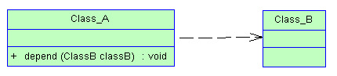
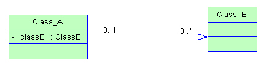
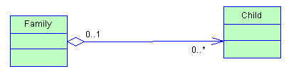
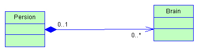
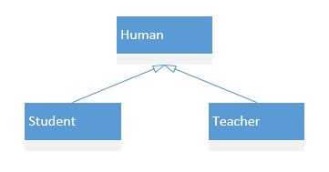
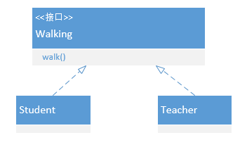

# 关系

## 1 依赖关系 Dependency

A --> B

表现在代码层面，为类B作为参数被类A在某个method方法中使用；

​

## 2 关联关系 Association

表现在代码层面，为被关联类B以类属性的形式出现在关联类A中，也可能是关联类A引用了一个类型为被关联类B的全局变量；

## 3 聚合（Aggregation）
关联关系特例

表现在代码层面，和关联关系是一致的，只能从语义级别来区分；

 **has-a关系**

 计算机 has cpu 内存 硬盘

​

## 4 组合（复合，Composition）

关联关系特例

**contains-a 关系**

> 他同样体现整体与部分间的关系，但此时整体与部分是不可分的，整体的生命周期结束也就意味着部分的生命周期结束；比如你和你的大脑

## 5 泛化（Generalization）

类实线 接口虚线

