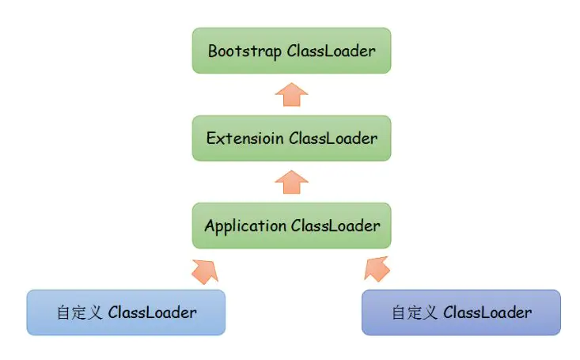
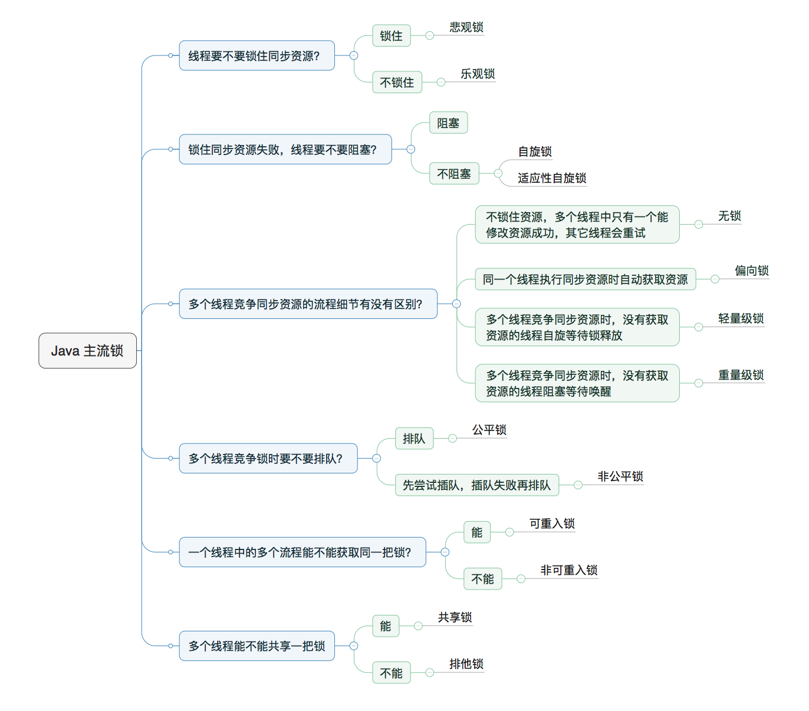
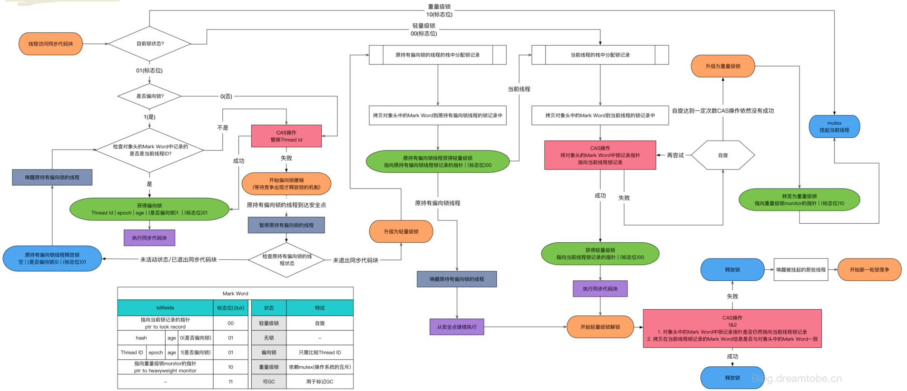
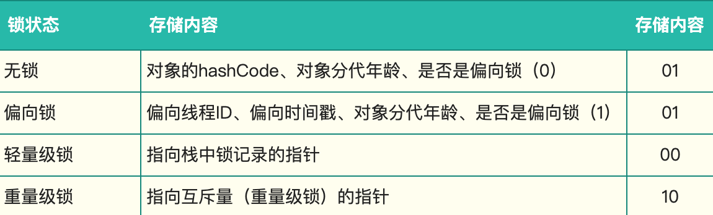

# 类加载器

[https://docs.oracle.com/javase/specs/jvms/se8/html/jvms-5.html](https://docs.oracle.com/javase/specs/jvms/se8/html/jvms-5.html)

类加载过程？

Loading 加载

Linking 链接：步骤

验证Verification

准备Preparation

解析Resolution

initialization 初始化

双亲委派模型？：parent翻译叉劈

SPI 上下文类加载器：

Thread.current.currentThread().getContextClassLoader()

# 锁

概念：

悲观 or 乐观

公平 or 非公平

可重入 or 非可重入

自旋 ，读写

synchronized实现原理？

MESA 模型 monitor管程

synchronized锁升级过程？

对象头源码markOop.hpp。偏向锁源码biasedLocking.cpp。以及其他源码ObjectMonitor.cpp和BasicLock.cpp

[https://www.cnblogs.com/soul-keeper/p/12762344.html](https://www.cnblogs.com/soul-keeper/p/12762344.html)

sync的四种状态： 无锁 VS 偏向锁 VS 轻量级锁 VS 重量级锁

通过对象头标记

synchronized和ReentrantLock的区别？

释放

ReentrantLock通过读写volatile标记的state实现 可见性